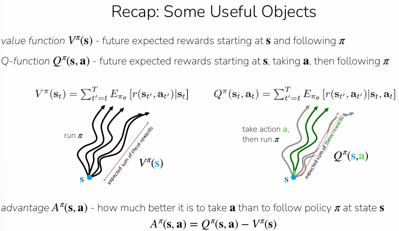

# Actor-Critic Methods




# Improving Policy Gradients

Improving policy gradients focuses on making the algorithms more **data-efficient** and **reducing the noise** in gradient estimates. According to the sources, this is primarily achieved by moving from simple sample-based reward estimates to more sophisticated methods for estimating future rewards.

The key components of this improvement include:

## 1. Moving Beyond Single Samples

Vanilla policy gradients typically use a single-sample estimate of the "reward-to-go". The sources suggest that using the **true expected reward-to-go** ($Q(s_t, a_t)$) would be significantly better. Better estimates of these values lead to **less noisy gradients**, which allows the policy to improve more reliably.

## 2. Using the Advantage Function

A major improvement involves using the **Advantage function**, $A^\pi(s_t, a_t)$, instead of raw rewards.

- **Definition**: It is defined as $A^\pi(s_t, a_t) = Q^\pi(s_t, a_t) - V^\pi(s_t)$.
- **Purpose**: It represents **how much better** a specific action ($a_t$) is compared to the average expected reward at that state ($s_t$).
- **Baseline**: By subtracting a baseline (like the state-value function $V^\pi(s_t)$), the algorithm reduces variance, making the training process more stable.

## 3. The Actor-Critic Framework

These improvements form the basis of **Actor-Critic methods**. In this framework:

- **The Actor**: The policy itself, which is updated to do more of the "good" stuff and less of the "bad" stuff.
- **The Critic**: A learned model (often a neural network) that estimates the expected return ($V^\pi, Q^\pi, \text{or } A^\pi$).

Note that both are being learnt.

## 4. Methods for Estimating Value

To improve the policy, the "critic" must accurately evaluate the current policy. The sources outline three ways to perform this **policy evaluation**:

- **Monte Carlo Estimation**: Fitting a model directly to the observed sum of future rewards from actual roll-outs.
- **Bootstrapping (Temporal Difference Learning)**: Fitting a model to a target consisting of the current reward plus the value estimate of the next state ($r + V$). This is often less noisy than Monte Carlo but can be biased.
- **N-step Returns**: A hybrid approach that uses the sum of rewards for $n$ steps plus the value estimate of the state reached at step $n$. This is often the most effective method in practice.

Note: Only need to estimate $V^\pi$


### 1. Monte Carlo Estimation

Run the whole episode, sum all the rewards, use that as training label. 

```latex
Episode 1:  s₀ → s₁ → s₂ → ... → s_T   (total return: 12)
Episode 2:  s₀ → s₁ → s₃ → ... → s_T   (total return: 3)
Episode 3:  s₀ → s₄ → s₂ → ... → s_T   (total return: 8)
...
Episode 1000: ...                         (total return: 10)
```

This method involves sampling actual "roll-outs" from the policy and using the observed sum of rewards as a target.

- **The Process**: You collect a batch of data and aggregate single-sample estimates of the "reward-to-go".
- **Target**: For a state $s_t$, the target value is the actual sum of rewards from that point until the end of the episode: $y_{i,t} \approx \sum_{t'=t}^{T} r(s_{i,t'}, a_{i,t'})$.
- **Supervised Learning**: You then use supervised learning to train a neural network ($\hat{V}_\phi^\pi$) to minimize the difference between its predictions and these actual summed rewards.


### 2. Bootstrapping (Temporal Difference Learning)

Instead of waiting for an episode to end, bootstrapping uses the current reward plus the model’s **own estimate** of the next state's value.

- **Target**:  $y_{i,t} \approx r(s_{i,t}, a_{i,t}) + \hat{V}_\phi^\pi(s_{i,t+1})$.
- **Iterative Updates**: Because the target depends on the current model, the labels are updated every time the gradient is updated.
- **Trade-off**: This method typically has **less variance** than Monte Carlo estimation but can introduce **bias** because it relies on the model's own (initially inaccurate) predictions.


```
repeat:
run policy in environment, collect (s, a, r, s') tuples

update critic: "your prediction for s was 5.0,
                but r + prediction(s') = 7.0,
                so adjust"

update actor: "action a in state s got more reward
               than the critic expected,
               so make a more likely in s"
```

### Monte Carlo Estimation vs Bootstrapping

- **Monte Carlo** uses full returns from actual sampled trajectories, so the target includes all the randomness from future rewards and transitions.
- **Bootstrapping** uses an estimated value function to stand in for part of the future return, which cuts off some of that randomness.

So the usual tradeoff is:

- **Monte Carlo:** lower bias, higher variance
- **Bootstrapping:** higher bias, lower variance

One useful way to remember it:

- **More sampled future rewards** → more variance
- **More reliance on learned value estimates** → less variance, more bias

### 3. N-Step Returns (The Hybrid Approach)

This is a "middle ground" that often works best in practice.

- **The Process**: You sum the next $n$ rewards from an actual roll-out and then add the model's estimate for the $(n+1)$-th state.
- **The Target**: $y_{i,t} \approx \sum_{t0=t}^{t+n-1} r(s_{i,t0}, a_{i,t0}) + \hat{V}_\phi^\pi(s_{i,t+n})$.
- **Benefit**: It balances the high variance of Monte Carlo (by using fewer samples) with the bias of bootstrapping (by using more real data before relying on an estimate)
- More real steps (bigger n) → **less bias**, because relying less on the critic's potentially wrong estimate
- Fewer real steps (smaller n) → **less variance**, because not accumulating noise from many stochastic transitions


### The Role of Discount Factors ($\gamma$)

When estimating values, especially for very long or infinite episodes, a **discount factor** ($\gamma$) is used. This ensures rewards received sooner are weighted more heavily than those received later, preventing value estimates from growing infinitely large. A common value used in practice is 0.99.


### Fitting the Model

In all these methods, the final step is to perform **supervised learning** on a neural network with parameters $\phi$. The loss function used is typically a mean squared error between the estimated value and the chosen target ($y_i$):
$\mathcal{L}(\phi) = \frac{1}{N} \sum_{i} ||\hat{V}_\phi^\pi(s_i) - y_i||^2$.


## 5. Off-Policy Improvements

To further increase data efficiency, the sources discuss **off-policy** methods, which allow the algorithm to reuse data from past policies rather than just the current one. This often involves:

- **Replay Buffers**: Storing all past trial-and-error data to reuse in updates.
- **Importance Weights**: Adjusting the gradient calculations to account for the fact that the data was collected by a different version of the policy.

# Off-Policy Actor-Critic: Multiple Gradient Steps

## Problem

In vanilla on-policy actor-critic, we:

1. Collect one batch of data from policy $\pi_\theta$
2. Take **one** gradient step
3. Throw away the data and recollect

This is wasteful. **Can we take multiple gradient steps on the same batch?**

---

## Step 1: The On-Policy Gradient (Starting Point)

The standard policy gradient with advantages:

$\nabla_\theta J(\theta) \approx \frac{1}{N} \sum_{i=1}^{N} \sum_{t=1}^{T} \nabla_\theta \log \pi_\theta(a_{i,t} | s_{i,t}) \hat{A}^{\pi_\theta}(s_{i,t}, a_{i,t})$

**Problem:** After one gradient step, $\theta$ changes to $\theta'$, but the data was collected under $\theta$. The gradient formula above assumes data came from $\pi_\theta$, not $\pi_{\theta'}$.

---

## Step 2: Importance Weights Fix the Distribution Mismatch

To use data from $\pi_\theta$ while updating $\pi_{\theta'}$, we multiply by importance weights:

$\nabla_{\theta'} J(\theta') \approx \sum_{t,i} \frac{\pi_{\theta'}(a_{i,t} | s_{i,t})}{\pi_\theta(a_{i,t} | s_{i,t})} \nabla_{\theta'} \log \pi_{\theta'}(a_{t,i} | s_{t,i}) \hat{A}^{\pi_\theta}(s_{t,i}, a_{t,i})$

**Intuition:** The ratio $\frac{\pi_{\theta'}}{\pi_\theta}$ reweights each sample to account for the fact that $\theta'$ would have taken these actions with different probabilities than $\theta$.

---

## Step 3: The Surrogate Objective

Using the identity $p_\theta(\tau) \nabla_\theta \log p_\theta(\tau) = \nabla_\theta p_\theta(\tau)$, we can write an equivalent **surrogate objective** that we maximize directly:

$\tilde{J}(\theta') \approx \sum_{t,i} \frac{\pi_{\theta'}(a_{i,t} | s_{i,t})}{\pi_\theta(a_{i,t} | s_{i,t})} \hat{A}^{\pi_\theta}(s_{t,i}, a_{t,i})$

The gradient of this objective w.r.t. $\theta'$ gives us exactly the importance-weighted policy gradient from Step 2.

---

## Step 4: What Goes Wrong with Many Gradient Steps

If we maximize $\tilde{J}(\theta')$ with many gradient steps:

- The advantages $\hat{A}^{\pi_\theta}$ are computed under the **old** policy $\pi_\theta$
- The optimizer will push $\pi_{\theta'}$ to put **massive probability** on actions that had high advantage
- The importance ratio $\frac{\pi_{\theta'}}{\pi_\theta}$ can blow up (e.g., become 100x or 1000x)
- **Result:** $\pi_{\theta'}$ diverges far from $\pi_\theta$, and the advantage estimates become meaningless → overfitting / policy collapse

---

## Step 5: Two Ideas to Fix This

### Idea 1 — KL Constraint

Constrain how far $\theta'$ can drift from $\theta$:

$\mathbb{E}{s \sim \pi\theta} \left[ D_{KL}(\pi_{\theta'}(\cdot | s) | \pi_\theta(\cdot | s)) \right] \leq \delta$

This is used heavily in TRPO and later in LLM preference optimization (RLHF).

### Idea 2 — Clip the Importance Weights (PPO's approach)

Don't constrain the policy directly, but **remove the incentive** for the policy to diverge by bounding the ratio.

---

## Step 6: PPO Trick #1 — Clipping

Clip the importance ratio to $[1 - \epsilon, \ 1 + \epsilon]$

$\tilde{J}(\theta') \approx \sum_{t,i} \text{clip}\left(\frac{\pi_{\theta'}(a_{i,t} | s_{i,t})}{\pi_\theta(a_{i,t} | s_{i,t})}, \ 1 - \epsilon, \ 1 + \epsilon \right) \hat{A}^{\pi_\theta}(s_{t,i}, a_{t,i})$

**Effect:** Even if $\pi_{\theta'}$ wants to put 100x more probability on a high-advantage action, the clipped ratio caps the benefit at $(1 + \epsilon)$. No incentive to deviate further.

---

## Step 7: PPO Trick #2 — Pessimistic Minimum

In rare cases, clipping can accidentally make the objective *better* than the unclipped version. PPO takes the **minimum** of both to be conservative:

$\tilde{J}(\theta') \approx \sum_{t,i} \min\left( \frac{\pi_{\theta'}}{\pi_\theta} \hat{A}^{\pi_\theta}, \quad \text{clip}\left(\frac{\pi_{\theta'}}{\pi_\theta}, 1-\epsilon, 1+\epsilon\right) \hat{A}^{\pi_\theta} \right)$

This is the **final PPO surrogate objective**.

---

## Step 8: PPO Trick #3 — Generalized Advantage Estimation (GAE)

Instead of using a single n-step advantage estimate, GAE blends multiple horizons:

**n-step advantage:**

$\hat{A}_n^\pi(s_t, a_t) = \sum_{t'=t}^{t+n} \gamma^{t'-t} r(s_{t'}, a_{t'}) - \hat{V}_\phi^\pi(s_t) + \gamma^n \hat{V}_\phi^\pi(s_{t+n})$

**GAE = weighted sum of all n-step estimates** $\hat{A}_n^\pi(s_t, a_t)$**:**

$\hat{A}_{GAE}^\pi(s_t, a_t) = \sum_{n=1}^{\infty} w_n \hat{A}_n^\pi(s_t, a_t)$

**Weights decay exponentially:** $w_n \propto \lambda^{n-1}$

- Small $\lambda$ → more weight on short horizons → **low variance, high bias**
- Large $\lambda$ → more weight on long horizons → **high variance, low bias**

---

## The Full PPO Algorithm

1. Sample batch of trajectories ${(s_{1,i}, a_{1,i}, \ldots, s_{T,i}, a_{T,i})}$ from $\pi_\theta$. 
2. Fit $\hat{V}_\phi^{\pi\theta}$ to sampled reward sums. 
3. Compute $\hat{A}_{GAE}^\pi$ for all $(s,a)$ pairs in batch. 
4. Take $M$ gradient steps on the clipped surrogate objective.
5. Go back to step 1.

### Typical Hyperparameters

| Parameter | Value |
| --- | --- |
| Batch size | ~2000 timesteps |
| Policy update epochs | ~10 |
| Gradient steps per iteration | ~300 (batch size 64) |
| Clipping range $\epsilon$ | 0.2 |
| Total iterations | ~500 → 1M timesteps |

---

## Key Takeaway

PPO = **"take multiple gradient steps on the same batch, but don't let the policy change too much."** The clipped surrogate objective is a simple, effective way to enforce this without explicitly computing KL divergences.

# Replay Buffers

---

## Motivation

PPO reuses one batch for multiple gradient steps. But can we go further — reuse *all* past data from previous batches? This is "fully off-policy."

Two key ideas: (1) maintain a replay buffer of all past transitions, (2) fix the equations so they work with off-policy data.

---

## The Naive (Broken) Algorithm

Start with the on-policy actor-critic but sample from the replay buffer instead:

1. Collect experience from $\pi_\theta$, store $(s, a, s', r)$ in buffer $\mathcal{R}$
2. Sample minibatch ${s_i, a_i, r_i, s'_i}$ from $\mathcal{R}$
3. Update $\hat{V}^\pi_\phi$ using targets:
$y_i = r_i + \gamma \hat{V}^\pi_\phi(s'_i)$
4. Evaluate advantage:
$\hat{A}^\pi(s_i, a_i) = r(s_i, a_i) + \gamma \hat{V}^\pi_\phi(s'i) - \hat{V}^\pi\phi(s_i)$
5. Compute policy gradient:
$\nabla_\theta J(\theta) \approx \frac{1}{N} \sum_i \nabla_\theta \log \pi_\theta(a_i | s_i) , \hat{A}^\pi(s_i, a_i)$
6. Update parameters:
$\theta \leftarrow \theta + \alpha \nabla_\theta J(\theta)$

**Why is this broken?**

Two problems:

**Problem 1 — Value function targets are wrong.** The target $y_i = r_i + γV̂(s'_i)$ assumes the next-state value is computed under the *current* policy $π_θ$. But the transition $(s_i, a_i, s'_i)$ came from an *old* policy. The future reward from $s'_i$ depends on what action you'd take there. $V(s')$ bakes in the assumption that you follow $\pi$ — but the data was generated by some old $π_{old}$. The value function is learning something that doesn't correspond to any single policy.

**Problem 2 — Policy gradient uses wrong actions.** Step 5 computes $∇_θ log π_θ(a_i|s_i)$ — but $a_i$ was chosen by the old policy, not the current one. The advantage $Â^π(s_i, a_i)$ evaluates how good that old action was, but we need to evaluate actions the *current* policy would take.


---

### The Fix: Use $Q(s, a)$ Instead of $V(s)$

**Key insight:** $V(s)$ implicitly depends on which policy's actions you average over. But $Q(s, a)$ takes the action as an explicit input — so it doesn't matter *who* chose action a. You can evaluate $Q$ on any $(s, a)$ pair regardless of which policy generated it.

**Recall the Bellman equation for Q:**

$Q^{π_θ}(s, a) = r(s, a) + γ 𝔼_{s' ~ p(·|s,a), ā' ~ π_θ(·|s')} [Q^{π_θ}(s', ā')]$

The next-state action $ā'$ is sampled from the **current** policy $π_θ$, not from the buffer. This is what makes it valid for off-policy data.

---

### The Fixed Algorithm (Step by Step)

**Step 1: Collect & Store**

Take action $a ~ π_θ(a|s)$, observe $(s, a, s', r)$, store in replay buffer $R$.

**Step 2: Sample Minibatch**

Sample batch ${s_i, a_i, r_i, s'_i}$ from buffer $R$. These transitions may be from old policies — that's fine.

**Step 3: Update Q-function**

For each sampled transition, compute the target:

- Sample fresh action from current policy: $ā'_i ~ π_θ(·|s'_i)$
- Compute target: $y_i = r(s_i, a_i) + γQ̂^π_ϕ(s'_i, ā'_i)$

Note: $s_i$ and $a_i$ are from the buffer (old policy), but $ā'_i$ is from the *current* policy. This is the critical fix — the bootstrap target uses the current policy's action at the next state.

Minimize the loss:

$L(ϕ) = \frac1N * Σ_i ‖Q̂^π_ϕ(s_i, a_i) - y_i‖²$

**Step 4: Update Policy**

Now we also fix the policy gradient. Instead of using buffer actions, sample *new* actions from the current policy:

- Sample: $a^π_i ~ π_θ(·|s_i)$

Compute gradient:

$∇_θ J(θ) ≈ \frac1N Σ_i ∇_θ log π_θ(a^π_i|s_i) · Q̂^π(s_i, a^π_i)$

Both the action $a^π_i$ and the Q-evaluation use the current policy — **not** the buffer's actions.

Note: we use $Q̂$ directly here instead of the advantage $Â = Q - V$. This is higher variance (no baseline subtraction), but acceptable because we now have much more data from the full replay buffer.

**Step 5: Gradient Update**

$θ ← θ + α∇_θ J(θ)$


---

### Remaining Issue

The states $s_i$ in the buffer didn't come from the current policy's state distribution $p_θ(s)$. There's nothing we can do about this — we just accept it.

**Intuition for why it's okay:** We want an optimal policy on $p_θ(s)$, but we're optimizing on a *broader* state distribution (mix of all past policies). In practice, optimizing on a broader distribution often still works and can even help with generalization.

---

### Implementation Detail: Reparameterization Trick

For continuous actions with a Gaussian policy, instead of using the log-likelihood policy gradient, you can use the **reparameterization trick** to get a lower-variance gradient estimate:

$a = μ_θ(s) + σ_θ(s) · ε$, where ε ~ N(0, 1)

This lets you backprop through the action sampling directly into $Q̂$, rather than relying on the REINFORCE-style log π gradient.

---

### This Becomes SAC (Soft Actor-Critic)

The practical instantiation of this approach is SAC (Haarnoja et al., 2018), which adds entropy regularization and some Q-function fitting tricks (twin Q-networks, target networks — covered in later lectures).

---

### PPO vs SAC — When to Use Which

|  | PPO | SAC |
| --- | --- | --- |
| Off-policy degree | Mild (multiple steps on one batch) | Full (replay buffer of all past data) |
| Data efficiency | Lower | Much higher |
| Stability | More stable, easier to tune | Harder to tune, less stable |
| Best for | Simulation (cheap data), LLM RLHF | Real-world RL (expensive data) |