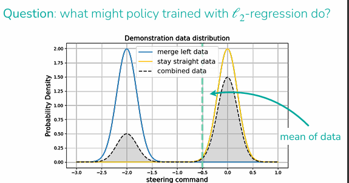

# Imitation Learning

# TLDR

- Offline BC: simple, no need for data from policy
    - Best if policy is an expressive generative model over actions
- DAgger: possible path to reliable performance, more data-efficient than offline BC
- No need to define a reward function
- May need impractically large amount of data for reliable performance
- Doesn’t provide a framework for improving on own (from “practicing”)
- Many successful methods combine imitation learning and reinforcement learning

## Offline vs Online Policies

Offline: using only an existing dataset, no new data from learned policy

- No need for data from policy, as online data can be unsafe, expensive to collect
- No need to define a reward function
- May need a lot of data for reliable performance

Online: using new data from learned policy 

### **1. Basic Imitation Learning (Offline)**

This approach, often called **behavior cloning (BC)**, follows these steps:

1. **Collect Demonstrations:** Gather a dataset $\mathcal{D} := {(s_1, a_1, \dots, s_T)}$ of trajectories from an expert, such as human drivers or sensor readings.
2. **Train the Policy:**
    - **Version 0 (Deterministic):** Use **supervised regression** to match the expert's actions. The formula used is to minimize the L2 loss:
    $\min_\theta \frac{1}{|\mathcal{D}|} \sum_{(s,a) \in \mathcal{D}} ||a - \hat{a}||^2 \text{ where } \hat{a} = \pi_\theta(s)$.
    - **Version 1 (Expressive/Generative):** Train a generative model (like Diffusion or Mixture of Gaussians) to represent the distribution of expert actions. The goal is to **maximize the log probability** of the demonstration actions:
    $\min_\theta - \mathbb{E}{(s,a) \sim \mathcal{D}} [\log \pi\theta(a|s)]$.
        - Reason is that if we use version 0, imagine for autonomous driving, either move left, move right or stay middle, imagine we have 2 peaks —> if the model tries to average these 2 actions, it will result in a “middle of the road” command, which causes the car to be not take either lanes
            
            
            
3. **Deploy:** Run the learned policy $\pi_\theta$ in the environment.

---

### **2. DAgger: Dataset Aggregation (Online)**

To address **compounding errors**—where small mistakes lead the agent into states the expert never visited—the **DAgger** algorithm uses an iterative online process:

1. **Roll out** the currently learned policy $\pi_\theta$ to collect new states $s'_1, \dots, s'_T$.
2. **Query the expert** for the correct action $a^*$ *to take in those specifically visited states (*$a^ *\sim \pi_{expert}(\cdot|s')$).
3. **Aggregate** these new expert-labeled corrections with the existing dataset: $\mathcal{D} \leftarrow \mathcal{D} \cup {(s', a^*)}$.
4. **Update the policy** by retraining on the expanded dataset: $\min_\theta \mathcal{L}(\pi_\theta, \mathcal{D})$.

### Compounding error:

---

### **3. Human-Gated DAgger (HG-DAgger)**

This variation is more practical for human-robot interaction because the expert only intervenes when necessary:

1. **Start roll-out** of the learned policy $\pi_\theta$.
2. **Expert intervenes** at time $t$ only when they observe the policy making a mistake.
3. **Expert provides a (partial) demonstration** by taking full control of the agent.
4. **Aggregate** these new demonstrations with the existing data: $\mathcal{D} \leftarrow \mathcal{D} \cup {(s'_i, a^*_i)}$ for all steps $i \ge t$.
5. **Update the policy** $\pi_\theta$ using the combined data.

