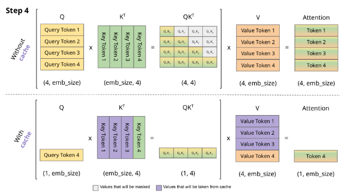

# KV Cache

# TLDR:

Caching the Key ($K$) and Value ($V$) states during multiple token generation steps and only happens in the decoder.

Encoder models are not generative and thus do not have KV caching

# Why cache?

Since the decode is causal, at each generation step we are recalculating the same previous token attention, even when we only want to calculate the attention for the new token (e.g. token 4 in the image below) 

$$
A = \mathrm{softmax}(\frac{Q K^\top}{\sqrt{d_k}})V 
$$

In the image above, the purple $K^T$ columns and $V$ rows are cached. With KV Caching, the matrices are smaller and thus matrix multiplication is faster. 

# Step-by-step Process:

1. **First generation:** when the model sees the first input, it calculates and stores its keys and values in the cache
2. **Next tokens**: for each new token, the model retrieves the stored keys and values and add the new ones instead of starting over 
3. **Efficient Attention Computation**: Calculate attention using cached $K$ and $V$along with the new $Q$ to compute the output 
4. **Update input**: add the newly generated token to the input.
5. Repeat from step 2 until $<EOS>$ token generated. 

# Computations that will not be repeated

1. $K$ and $V$ projections for previous tokens
2. All earlier layers’ forward pass for the whole prefix i.e. dont need to re-encode tokens $1…t$ through layer $1…L$ again 
3. Full attention matrix work for `prefix x prefix` at each step
    1. no longer do attention where queries include all tokens
    2. instead at each step $t + 1$ , compute attention only for the new query against cached keys 

With cache, at step $t + 1$ per layer, only compute:

1. new tokens’s $Q, K, V$
2. attention scores for token $t+1$: $QK^T$
3. attention output: $softmax(scores)V$

# Comparison

| **Feature** | **Standard Inference** | **KV Caching** |
| --- | --- | --- |
| **Computation per token** | The model repeats the same calculations for every token. | The model reuses past calculations for faster results. |
| **Memory Usage** | Uses less memory at each step, but memory grows with longer texts. | Uses extra memory to store past information, but keeps things efficient. |
| **Speed** | Gets slower as the text gets longer because it repeats work. | Stays fast even with longer texts by avoiding repeated work. |
| **Efficiency** | High computational cost and slower response times. | Faster and more efficient since the model remembers past work. |
| **Handling Long Texts** | Struggles with long texts due to repeated calculations. | Perfect for long texts as it remembers past steps. |

# References:

1. [https://huggingface.co/blog/not-lain/kv-caching](https://huggingface.co/blog/not-lain/kv-caching)
2. [https://medium.com/@joaolages/kv-caching-explained-276520203249](https://medium.com/@joaolages/kv-caching-explained-276520203249)