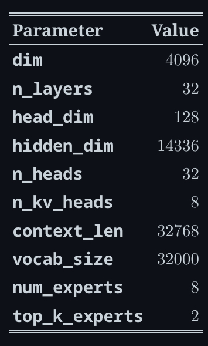

# Mixture of Experts (MoE)

# **TLDR**

MoEs:

- Are **pretrained much faster** vs. dense models
- Have **faster inference** compared to a model with the same number of parameters
- Require **high VRAM** as all experts are loaded in memory
- Face many **challenges in fine-tuning**, but [**recent work**](https://arxiv.org/pdf/2305.14705.pdf) with MoE **instruction-tuning is promising**

# MoE

1. Sparse MoE layers are used instead of dense feed-forward network (FFN) layers. 
    1. Each MoE is a FFN, but can also be more complex networks
2. Gate network / router
    1. Determines which tokens are sent to which expert
    2. Note that each token will be passed to the top K experts
    3. Router is composed of learned parameters and pretrained with the rest of the network 

FFN layer of transformer block is replaced with a MoE layer, which composes of gate network FFN + experts 

## Challenges:

### Training

- Struggle to generalise during fine-tuning — overfits

### Inference

- MoE has many parameters that is loaded into RAM, even though only some of them are used during inference

Note: MoE like Mixtral 8x7B ⇒ 8 experts to replace the FFN + 7B transformer backbone (attention, embeddings, etc are shared / dense) 

we’ll need to have enough VRAM to hold a dense 47B parameter model. Why 47B parameters and not 8 x 7B = 56B? That’s because in MoE models, only the FFN layers are treated as individual experts, and the rest of the model parameters are shared. At the same time, assuming just two experts are being used per token, the inference speed (FLOPs) is like using a 12B model (as opposed to a 14B model), because it computes 2x7B matrix multiplications, but with some layers shared

## Parameter Maths

### Expert Parameters

In Mixtral 8x7B, parameters per expert per layer will have 3 matrices

- 2 “up/gate”:

$$
4096 \times 14336 \ \text{each}
$$

- 1 “down”:

$$
 14336 \times 4096 
$$

Num Parameters per expert per layer:

$$
3 \times 4096 \times  14336 = 170,160,768 \approx 0.176B
$$

Num Parameters with 8 experts per layer and 32 layers:

$$
 0.176B \times 8 \times 32 \approx 45.1B
$$

### Attention Parameters

Per layer, with 32 Q heads and 8 KV heads:

$$
W_Q: 4096 \times 4096 \\
W_K: 4096 \times (8\cdot128)=4096\times1024 \\ 
W_V: 4096 \times 1024 \\ 
W_O: 4096 \times 4096
$$

Per layer total:

$$
4096^2 + 2\cdot(4096\cdot1024) + 4096^2 \approx 41.94M
$$

Across 32 layers:

$$
41.94M \times 32 \approx 1.34B
$$

### **Embeddings Parameters (+ often an output LM head)**

Token embedding matrix:

$$
32000 \times 4096 \approx 0.131B
$$

Many implementations also count a separate output projection (LM head) of similar size (if not weight-tied), adding another ~0.131B.

### Total Parameters

$$
\text{Total Parameters}
= \text{MoE FFNs}
+ \text{Attention}
+ \text{Embeddings}
+ \text{LM head}
= 45.1 + 1.34 + 0.13 + 0.13
= 46.7\text{B}
$$

### Inference Parameters

$$
\text{Inference Parameters} = \frac{45.1} 4 + 1.34 + 0.13 + 0.13 = ~ 12.9B 
$$

# Sparsity

- Idea of conditional computation
    - Dense models use all parameters, sparse models use only some parameters
    - Allows to scale size of model without increasing the computation
- Can lead to uneven batch sizes and underutilisation
    - E.g. If batched input has 10 tokens, 5 might go to 1 expert, and the other five tokens go to 5 different experts

# Learned Gating Network (G)

- Decides which expert to route to

$$
y = \sum_{i=1}^{n} G(x)_i\,E_i(x)
$$

$$
G_{\sigma}(x) = \operatorname{Softmax}(x W_g)
$$

### Noisy Top-K Gating

- Introduces some noise and then keeps the top $k$ values.
- Needed because upon random initialization of weights, routing will be random, but the experts that are routed to first will be biased.

1. We add some noise

$$
H(x)_i = (xW_g)_i + \mathcal{N}(0,1)\cdot \operatorname{Softplus}\big((x W_{\text{noise}})_i\big)
$$

1. We only pick the top $k$

$$
\operatorname{KeepTopK}(v, k)_i =
\begin{cases}
v_i & \text{if } v_i \text{ is in the top-}k\text{ elements of } v,\\
-\infty & \text{otherwise.}
\end{cases}
$$

1. We apply the softmax

$$
G(x) = \operatorname{Softmax}\big(\operatorname{KeepTopK}(H(x), k)\big)
$$

## Load Balancing of Tokens

### Problem of tokens going to the same popular experts

- Upon random initialisation of weights, some experts receive tokens by chance
- Since gating network usually converges to mostly activate the same few experts, this self-reinforces as favoured experts are trained quicker and hence selected more.

### Solution

- Add auxiliary loss to encourage giving all experts equal importance i.e. load balancing of tokens

# Case Study: G-Shard

### Architecture

- replaces every other FFN layer with MoE layer using top-2 gating in both encoding and decoder.
- Beneficial for large scale computing when MoE layer is shared across devices while all other layers are replicated

### Load Balancing of Tokens in G-Shard

1. Random Routing 
    1. in top-2 setup, always pick the top expert
    2. 2nd expert is always picked with probability proportional to its weight 
2. Expert Capacity
    1. Set threshold of how many tokens can be processed by one expert
    2. If both experts are at capacity, token is considered overflowed and is sent to the next layer via residual connections (or dropped entirely) 
    3. Useful as we only know how many tokens will go to each expert during runtime. 

# Case Study: Switch Transformers

## Architecture

- Replace FFN layer with MoE layer
- Receives 2 inputs (2 different tokens) and has 4 experts
- Uses only 1 expert
    - Router computation reduced
    - Batch size of each expert can be at least halved
    - Communication costs are reduced
    - Quality is preserved

## Expert Capacity

Expert Capacity = (token per batch / number of experts) * capacity factor

- (token per batch / number of experts) represents the number of tokens to each expert if equal weight (i.e. capacity factor = 1)
- If capacity factor > 1, we provide a buffer for when tokens are not perfectedly balanced.
- Increasing capacity ⇒ more expensive inter-device communication
- Switch Transformers perform well at low capacity factors (1 - 1.25 range)

### Load Balancing Loss

- For each Switch layer, auxiliary loss is added to the total model loss during training
    - This loss encourages uniform routing and can be weighted using a hyperparameter

### Experimentations with Precision

- Lower precision ⇒ reduce communication costs between processes, computation costs and memory for storying tensors
- Router has an exponentiation functions (when using `softmax` )
    - `bfloat16` results in unstable training while `float32` was much better

# Stabilising training with router Z-loss

- Balancing loss can lead to instability issues
- Solutions are:
    - Introduce dropout ⇒ improve stability but lead to loss of model quality
    - Add more multiplicative components ⇒ improve quality but decreases stability ( check what add more multiplicative  components mean)
- Router z-loss improve training stability without quality degradation by penalisaing large logits entering the gating network
    - Since the loss encourages absolute magnitude of values to be smaller, roundoff errors are reduced, which can be impactful for exponential functions such as the gating.  (review the paper for details in ST-MoE)

# What does an expert learn

- Encoding experts specialise in a group of tokens / shallow concepts
    - E.g. noun expert, verb expert, punctation expert, etc
- Decoder experts have less specialisations (no real specialisation)

# Difference between Attention Head and Expert

### 1. Dense vs Sparse

- Heads: all heads contribute
- Experts: only a few experts contribte per token

### 2. Specialisation

- Heads: specialise over relationships / positions (attention patterns)
- Experts: specialise over feature subspace/ token types/ contexts (different nonlinear transformations)

Head can become the head that attends to previous comma, or sarcasm while expert become the expert in code tokens, math tokens, etc 

### 3. Routing

- Heads: specialisation is implicit — learned via gradients
- Experts: Explicit router chooses experts per token

### Mental Model:

Attention = communication (gather relevant info from other tokens)

FFN = computation (transform / mix features at each token) 

Thus, multi-head attention ⇒ communication channels in parallel, while MoE FFN ⇒ many “computation specialists”, but only consult a couple per token  

# Number of Experts vs Pretraining

More experts results in: 

1. Improved sample efficiency (+)
2. Faster speedup (+)
3. Diminishing gains of experts (esp after 512) (-) 
4. more VRAM needed for inference  (-)

# Finetuning MoEs

Sparse models are prone to overfit because the small part of the very large model gets updated per token, and that part has huge capacity ⇒ many parameters to represent (and memorise) patterns 

## Auxiliary Loss

Turning off auxiliary loss did not impact quality significantly, even when up to 11% of the tokens were dropped. 

- Token dropping might be a form of regularisation that helps prevent overfitting

## Types of task

Sparse model does worse than dense counterpart in downstream tasks e.g. reasoning-heavy tasks, but perform disproportionately well in knowledge-heavy tasks 

A fewer number of experts helped at fine-tuning, and generalisation made the model do worse in smaller tasks but better in larger tasks 

In the small task (left), we can see clear overfitting as the sparse model does much worse in the validation set. In the larger task (right), the MoE performs well. This image is from the ST-MoE paper.

## Freezing weights

- Freezing non-expert weights while updating expert weights
    - Worsen performance
- Freezing expert weights while updating non-expert weights
    - Similar performance as to updating all weights
    - Can help speed up and reduce memory for finetuning.
    - Can be somewhat counter-intuitive as 80% of parameters are in the MoE layers.
        - Hypothesis is that, as expert layers only occur every 1/4 layers, and each token sees at most 2 experts per layer, updating the MoE parameters affects much fewer layers than updating other parameters

## Finetuning hyperparameters setup

Sparse models fine-tuned quality improves with higher learning rates and small batch sizes 

### **Parallelism**

Types of Parallelism:

- **Data parallelism:** the same weights are replicated across all cores, and the data is partitioned across cores.
- **Model parallelism:** the model is partitioned across cores, and the data is replicated across cores.
- **Model and data parallelism:** we can partition the model and the data across cores. Note that different cores process different batches of data.
- **Expert parallelism**: experts are placed on different workers. If combined with data parallelism, each core has a different expert and the data is partitioned across all cores

With expert parallelism, experts are placed on different workers, and each worker takes a different batch of training samples. For non-MoE layers, expert parallelism behaves the same as data parallelism. For MoE layers, tokens in the sequence are sent to workers where the desired experts reside.

### **Capacity Factor and communication costs**

Increasing the capacity factor (CF) increases the quality but increases communication costs and memory of activations. If all-to-all communications are slow, using a smaller capacity factor is better. A good starting point is using top-2 routing with 1.25 capacity factor and having one expert per core. During evaluation, the capacity factor can be changed to reduce compute.

### **Serving techniques**

A big downside of MoEs is the large number of parameters. For local use cases, one might want to use a smaller model. 

Some techniques that can help with serving:

- The Switch Transformers authors did early distillation experiments. By distilling a MoE back to its dense counterpart, they could keep 30-40% of the sparsity gains. Distillation, hence, provides the benefits of faster pretraining and using a smaller model in production.
- Recent approaches modify the routing to route full sentences or tasks to an expert, permitting extracting sub-networks for serving.
- Aggregation of Experts (MoE): this technique merges the weights of the experts, hence reducing the number of parameters at inference time

# Case Study: DeepSeekMoE

## Architecture Differences

### Number of Experts

1. Split each FFN expert into multiple smaller experts by educing FFN intermediate dimensions 
2. Increase number of activated experts per token 

Thus, route to more experts per token, but each expert is smaller. Idea is that more combinations ⇒ easier specialisation 

### Shared Experts

Reserve K shared experts that are always activated for every token. Idea is that shared experts have expertise that every token needs to receive 

### Load balancing focuses on both expert and devices

Want to reduce routing collapse — whereby router overuses a few experts

- Add expert-level balance loss to reduce collapse risk
- Add device-level balance loss that targets balancing across devices

# References

1. [https://huggingface.co/blog/moe](https://huggingface.co/blog/moe)
2. [https://medium.com/data-science/the-switch-transformer-59f3854c7050](https://medium.com/data-science/the-switch-transformer-59f3854c7050)
3. [https://www.youtube.com/watch?v=7yR5ScbK1qk](https://www.youtube.com/watch?v=7yR5ScbK1qk)
4. [https://arxiv.org/abs/2401.04088](https://arxiv.org/abs/2401.04088)
5. [https://arxiv.org/abs/2101.03961](https://arxiv.org/abs/2101.03961)
6. [https://arxiv.org/abs/2006.16668](https://arxiv.org/abs/2006.16668)
7. [https://arxiv.org/abs/2401.06066](https://arxiv.org/abs/2401.06066)