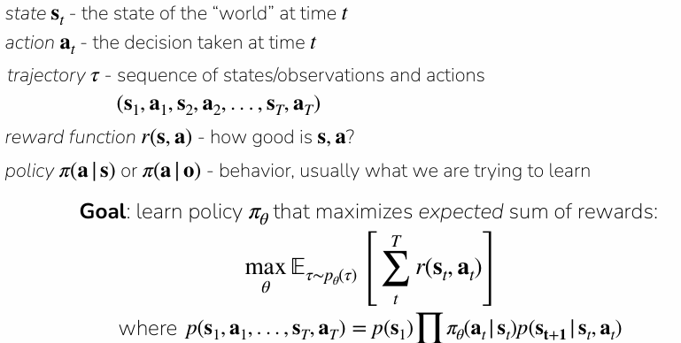

# Policy Gradient

Policy gradients are a fundamental class of reinforcement learning algorithms that aim to directly optimize the parameters of a policy to maximize expected rewards.

## TL;DR

1. Online RL via policy gradients
    1. On-policy algorithm, differentiating the RL objective
    2. Basesline, casuality for reducing gradient variance
    3. Collect batch of data, improve policy by applying gradient
2. Derived off-policy policy gradient
    1. Importance sampling
    2. KL constraint on policy
    3. Collect batch of data, apply multiple gradient updates
3. Intuition
    1. Encourage high reward actions, discourage low reward action
    2. Gradient still very noisy, best with large batch sizes and dense rewards

## The Reinforcement Learning Objective

The goal is to learn a policy, $\pi_\theta(a|s)$, parameterized by $\theta$, that maximizes the **expected sum of rewards** over trajectories $\tau$:
$J(\theta) = \mathbb{E}_{\tau \sim p_\theta(\tau)} [r(\tau)] = \mathbb{E}_{\tau \sim p_\theta(\tau)} \left[ \sum_{t=1}^T r(s_t, a_t) \right]$
where a trajectory $\tau$ is a sequence of states and actions $(s_1, a_1, \dots, s_T, a_T)$. 

The probability of a trajectory is given by:
$p_\theta(s_1, a_1, \dots, s_T, a_T) = p(s_1) \prod_{t=1}^T \pi_\theta(a_t|s_t) p(s_{t+1}|s_t, a_t)$

## Deriving the Gradient (The Log-Gradient Trick)

To improve the policy using gradient ascent, we need the gradient of the objective, $\nabla_\theta J(\theta)$. Directly differentiating the expectation is difficult because the distribution $p_\theta(\tau)$ itself depends on $\theta$

We use a "convenient identity" (the log-gradient trick):
$\nabla_\theta p_\theta(\tau) = p_\theta(\tau) \frac{\nabla_\theta p_\theta(\tau)}{p_\theta(\tau)} = p_\theta(\tau) \nabla_\theta \log p_\theta(\tau)$

Applying this to the objective:
$\nabla_\theta J(\theta) = \int \nabla_\theta p_\theta(\tau) r(\tau) d\tau = \int p_\theta(\tau) \nabla_\theta \log p_\theta(\tau) r(\tau) d\tau = \mathbb{E}_{\tau \sim p_\theta(\tau)} [\nabla_\theta \log p_\theta(\tau) r(\tau)]$

When we expand $\log p_\theta(\tau)$, the initial state distribution $p(s_1)$ and the environmental dynamics $p(s_{t+1}|s_t, a_t)$ do not depend on $\theta$, so their gradients are zero. This leaves only the sum of the log-probabilities of the policy's actions:
$\nabla_\theta J(\theta) = \mathbb{E}_{\tau \sim p_\theta(\tau)} \left[ \left( \sum_{t=1}^T \nabla_\theta \log \pi_\theta(a_t|s_t) \right) \left( \sum_{t=1}^T r(s_t, a_t) \right) \right]$

## Practical Estimation: The REINFORCE Algorithm

In practice, we estimate this expectation by sampling $N$ trajectories and averaging the results:
$\nabla_\theta J(\theta) \approx \frac{1}{N} \sum_{i=1}^N \left[ \left( \sum_{t=1}^T \nabla_\theta \log \pi_\theta(a_{i,t}|s_{i,t}) \right) \left( \sum_{t=1}^T r(s_{i,t}, a_{i,t}) \right) \right]$
Intuition: Reward weighted policy from online feedback

- **Increase the likelihood of actions** that were part of high-reward trajectories
- **Decrease the likelihood** of those in low-reward trajectories.

The final update rule is $\theta \leftarrow \theta + \alpha \nabla_\theta J(\theta)$, where $\alpha$ is the learning rate.

## Reducing Variance (Improving the Gradient)

Vanilla policy gradients can be very noisy and high-variance. Two key refinements are used to address this:

- **Causality:** A policy's behavior at time $t$ cannot affect rewards received in the past ($t' < t$). Therefore, we only multiply the log-probability of an action by the **sum of future rewards**:
$\nabla_\theta J(\theta) \approx \frac{1}{N} \sum_{i=1}^N \left[ \sum_{t=1}^T \nabla_\theta \log \pi_\theta(a_{i,t}|s_{i,t}) \left( \sum_{t'=t}^T r(s_{i,t'}, a_{i,t'}) \right) \right]$
- **Baselines:** We can subtract a constant baseline $b$ (often the average reward $b=\frac1N\sum_{i=1}^Br(\tau)$ ) from the total reward without changing the expected gradient. If we subtract with average reward, we get negative gradients for below-average behaviour. 
$\nabla_\theta J(\theta) = \mathbb{E}_{\tau \sim p_\theta(\tau)} [\nabla_\theta \log p_\theta(\tau) (r(\tau) - b)]$
    
    Note:  Subtracting a constant baseline does not change the gradient in expectation. It is unbiased and can reduce variance of the gradient
    
    
    
    
    
    All rewards is positive, thus action encouraged. 
    
    Also gradient has alot of samples, eventually will converge to a global optima of running forward. 
    

## Off Policy Gradient

### 1. Importance Sampling: The Mathematical Core

The standard RL objective is an expectation of rewards under the current policy distribution $p_\theta(\tau)$. To evaluate this using data from a different "proposal" distribution $\bar{p}(\tau)$ (an old policy), we use **importance sampling**:
$J(\theta) = \mathbb{E}_{\tau \sim \bar{p}(\tau)} \left[ \frac{p\theta(\tau)}{\bar{p}(\tau)} r(\tau) \right]$
The term $\frac{p_\theta(\tau)}{\bar{p}(\tau)}$ is the **importance weight**. When we expand the probability of a trajectory, the initial state distribution and environmental dynamics cancel out, leaving a product of the ratios of action probabilities:
$\frac{p_\theta(\tau)}{\bar{p}(\tau)} = \frac{p(s_1) \prod_{t=1}^T \pi_\theta(a_t|s_t) p(s_{t+1}|s_t, a_t)}{p(s_1) \prod_{t=1}^T \bar{\pi}(a_t|s_t) p(s_{t+1}|s_t, a_t)} = \prod_{t=1}^T \frac{\pi_\theta(a_t|s_t)}{\bar{\pi}(a_t|s_t)}$

### 2. The Problem with Trajectory-Level Ratios

A significant practical challenge is that for large horizons ($T$), this product of ratios can **explode or vanish**. Even small differences between the new and old policies at each timestep accumulate exponentially over the course of a trajectory, making the gradient estimate extremely unstable.

To solve this, the objective is shifted from an expectation over full trajectories to an **expectation over individual timesteps**. In this "common final form," the importance weights are applied per-step, which is much less likely to explode:
$\nabla_{\theta'} J(\theta') \approx \frac{1}{N} \sum_{i=1}^N \sum_{t=1}^T \frac{\pi_{\theta'}(a_{i,t}|s_{i,t})}{\pi_\theta(a_{i,t}|s_{i,t})} \nabla_{\theta'} \log \pi_{\theta'}(a_{i,t}|s_{i,t}) \left( \sum_{t'=t}^T r(s_{i,t'}, a_{i,t'}) - b \right)$
Note that this technically requires a ratio of the state distributions $\frac{\pi_{\theta'}(s_t)}{\pi_\theta(s_t)}$, but this is **often approximated as 1** in practice.

### 3. Constraints on Policy Change (KL Divergence)

Reusing data introduces a new risk: if the policy $\theta'$ changes too much, the old data $\pi_\theta$ no longer reflects the states the new policy will actually visit. This makes the gradient estimate inaccurate.

To mitigate this, off-policy algorithms often **constrain the policy** so it does not stray too far from the data-generating policy during updates. 

This is typically done using a **KL divergence constraint**:
$\mathbb{E}_{s \sim \pi_\theta} [D_{KL}(\pi_{\theta'}(\cdot|s) , \Vert , \pi_\theta(\cdot|s))] \leq \epsilon$

By enforcing this constraint, you can safely take **multiple gradient steps on the same batch of data** before needing to sample new trajectories from the environment. This is the foundation for advanced, popular algorithms like PPO.