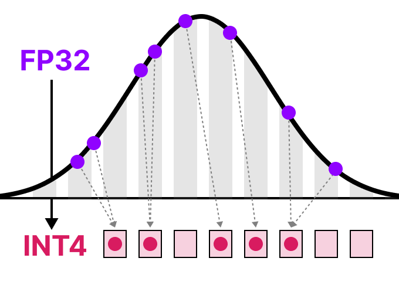

# Quantization

# TLDR

Replacing high-precision datatypes with low-precision data types in weights and activations. 

- e.g. replace `float32` with `int8`
- Reduces computational time and memory cost of running inference

# Problem

LLMs have billions of parameters ⇒ expensive to store + large inference time 

# Introduction

Goal: reduce number of bits needed to represent the original parameters while preserving precision of original parameters as best as possible 

Example of lower quality image due to quantization 

# Common Data Types

## FP32 → FP16

FP32 = full precision, FP16 = half precision 

Note how the range of values of FP16 is significantly smaller than FP32 

## FP32 → BF16

BF16 uses same amount of bits as FP16, but can take a wider range of values 

## FP32 → INT8

# Symmetric Quantization

Range of original FP values is mapped to a symmetric range around zero in quantized space. 

This means quantized value for zero in the FP space is exactly zero in the quantized space. 

Take highest absolute value as $\alpha$ as the range to perform the linear mapping

## Quantization Steps:

1. Set `int8` range. Note that unrestricted range is $[-128, 127]$, but here its $[-127, 127]$ to keep it symmetric 
2. Pick scale $s$
    
    Let $b$ be the number of bytes that we want to quantize to (i.e. $b=8$ for `int8`) 
    
    $$
    s = \frac{2^b-1}\alpha
    $$
    
3. Quantized input $x$
    
    $$
    X_{quantized} = round(s \times x) 
    $$
    

1. Dequantized value 
    
    $$
    X_{dequantized} = \frac{X_{quantized}}s
    $$
    

TLDR: Similar to min-max scaling, but trimming range to be symmetric and rounding to discrete values instead of continuous values 

## Quantization Error

Precision and original value is lost quantizing and then dequantizing values 

# Asymmetric Quantization

Maps the minimum $\beta$ and maximum $\alpha$ values from float range to minimum and maximum values of the quantized range

## Zero-Point Quantization

## Quantization Steps:

1. Compute scale $s$
    
    $$
    s = \frac{(128 --127)}{\alpha - \beta}
    $$
    
2. Compute new zero point $z$ (i.e. shift the zero point) 
    
    $$
    z = round(-s \times \beta) - 2^{b-1}
    $$
    
3. Quantize X 
    
    $$
    X_{quantized} = round(s *x+z) 
    $$
    
4. Dequantize 
    
    $$
    X_{dequantized} = \frac{X_{quantized} - z}s
    $$
    

# Symmetric vs Asymmetric

# Range Mapping and Clipping

When there are outliers that can skew the scale, we may clip the scale such that the range from the tensor $x$ is smaller (e.g. $[-5,5]$)

The outliers will be mapped to the min or max values of the range accordingly

No clipping vs clipping when there are outliers

# Calibration

Calibration is the process of selecting the arbitrary range during clipping, to find a range that includes as many values as possible while minimizing the quantization error 

## Weights and Biases

Weights and biases of a LLM are static as they are known before inference.

Recall: $Y = WX +b$

There are more significantly more weights (billions) than biases (millions) ⇒ biases are kept in higher precision such as `int16` , while main quantization is on the weights 

### Calibration Techniques

1. Manually choosing a percentile of the input range (similar to clipping idea) 
2. Optimising the MSE between original and quantized weights 
3. Minimise entropy (KL-divergence) between original and quantized values 

## Activations

$Y$ and $X$ in $Y = WX + b$ are activations as they go through activation function.

Unlike weights, activations vary w each input data fed into the model during inference, mkaing it hard to quantize them accurately. We only know what the values will be during inference when the input data passes through the model. 

# Post-Training Quantization

It involves quantizing a model’s paramteres after traing the model 

Quantization of weights is performed either using symmetric or asytmmetric quantization 

Quantization of activations requires inference of the model to get their potential distribution since we do not know their range

## Intuition:

During inference, we choose the next token based on the highest probability, and dont care about the exact probability (i.e. doesn’t matter if P(next_token = x) is equal to 0.9 or 0.6, as long as its the largest) ⇒ don’t need high precision ⇒ can afford to quantize post-training, trading off inference precision for speed and lesser memory. 

Two forms of quantization of the activations — dynamic quantization and static quantization

## Dynamic Quantization

After data passes a hidden layer, its activations are collected. 

This distribution of activations is then used to calculate the zeropoint $z$ and scale factor $s$ values needed to quantize the output:

This process repeats each time data passes through a new layer. Thus, each layer has its own separate $z$ and $s$ ⇒ different quantization schemes. 

## Static Quantization

Does not calculate $z$ and $s$ during inference, unlike dynamic quantization

Instead, calibration dataset is given to the model to collect these potential distributions. This calibration datasets are “example inputs” to get a rough idea of the statistics / distribution of the activations and decide the fixed quantization ranges based of aggregation.

## Dynamic vs Static Quantization

1. In dynamic quantization, $s$ and $z$ values are competed per hidden layer ⇒ each hidden layer has its own $s$ and $z$ instead of a global ones in static quantization. 
2. Inference time is longer but more accurate for dynamic quantization than static quantization

# Quantization Aware Training

Instead of quantizing a model via post-training quantization after it was trained, QAT aims to learn the quantization procedure during training 

QAT more accurate than PTQ since quantization  was already considered during training 

## Fake Quantization

During training, “fake” quants are introduced . This 

$$
quant(x) = round(\frac{x}s + z)
$$

Note that this is not differentiable, so the trick used in practice is to just assume no $round()$ operator when differentiating, and set the derivative to a neutral value of 1. 

## The core idea

During training, QAT **pretends** the model is quantized (low-precision) while still using floating-point math for learning. This lets the model **adapt to the quantization noise**.

### What gets “pretend-quantized”

- **Weights** (the parameters)
- **Activations** (layer outputs)

So the network learns parameters that will behave well when you later *actually* convert it to int8 (or similar).

## How it works (high level)

1. **Insert “fake quantization” ops** into the model graph during training.
    - Forward pass: values are **rounded/clipped** as if they were int8.
2. **Backprop still needs gradients**, but rounding isn’t differentiable.
    - QAT uses something like the **Straight-Through Estimator (STE)**: treat the rounding step as “identity” for gradients so learning can proceed.
3. After training, you **export/convert** the model to real quantized ops for inference.

## Key terms you’ll see

- **Fake Quantization**: simulate int8 in training without losing float training ability.
- **Scale / Zero-point**: how you map float values to integer range.
- **Per-tensor vs per-channel quantization**:
    - *Per-channel* (common for conv weights) usually gives better accuracy.
- **Calibration / observers**:
    - Track min/max (or stats) of activations to choose good scales.

## QAT vs Post-Training Quantization (PTQ)

- **PTQ**: train normally in float → quantize after training. Simple, but can lose accuracy, especially on smaller models or sensitive layers.
- **QAT**: train with quantization effects included → usually **better accuracy** in int8, but takes extra training effort.

# 1-bit LLMs: BitNet

### Absmean quantization

Quantization of weights → {-1, 0, 1} 

Compress distribution of weights using the absolute mean $\alpha$.

$$
w_{quantized} = round(\frac{w}\alpha)
$$

### Why “1.58-bit”?

Because a weight that can take **3 possible values** carries **log₂(3) ≈ 1.58 bits** of information. That’s where the number comes from.

### What’s the big idea?

Normal LLM layers do lots of matrix multiplies with FP16/BF16 weights. BitNet replaces the usual linear layer with a quantization-aware version (often described as **BitLinear**) so the model is **trained to work with ternary weights from the start**, instead of training in full precision and shrinking later.

Because weights are -1/0/+1, multiplications can be simplified a lot (many operations become adds/subtracts, and zeros skip work), which can make inference cheaper and more hardware-friendly.

## BitLinear

BitLinear layer works the same as a regular linear layer, just that the values in the weight matrix $W$ is 1 bit in $Y=WX$ and activation $x$ is `int8` precision 

### LayerNorm

LayerNorm shifts activation mean to 0 and variance to 1, making it resilient to outliers by normalising the tensor $x$

## Element-wise Lookup Table (ELUT)

Given ternary values {-1, 0, 1}, we require 2 bits to store these 3 possible values. Since computations are done in matrices, we group neighbouring values in matrices together and represent them using together 

### Table Lookup 1 (TL1)

### Table Lookup 2 (TL2)

TL1 is more efficient than TL2 as it is easier to pack 4 bits into an `int8` than 5 bits

This also means that we need custom logic to decode the binary encodings into values in matrices.

## Ternary Matrix Multiplication

Ternary weights essentially tell you the following:

- 1: I want to add this value
- 0: I do not want this value
- 1: I want to subtract this value

As a result, you only need to perform addition if your weights are quantized to 1.58 bit:

⇒ Speed up in computation and feature filitering. 

# 4-bit Quantization

Quantization error increases the more we decreased the bit precision. 

## GPTQ (GPT Quantizatoin)

GPTQ is a post-training weight-only quantization that compresses FFN to `int4.`

- Asymmetric quantization
- Quantization occurs row-by-row, then layer-by-layer, such that each layer is processed independently in sequence.

During the process, converts the layer’s weights into inverse-Hessian (second-order derivative of model’s loss function) ⇒ tells us how sensitive the model’s output is to changes in each weight ⇒ implicitly demonstrates the (inverse) importance of each weight in a layer.

In inverse-Hessian, lower values ⇒  small changes in those weights lead to larger changes ⇒ more important weights 

  

### Steps

1. Collect Calibration activations using calibration dataset (only forward pass)
    1. for a given linear layer, record its input activations X across tokens
2. Compute Hessian of the layer loss w.r.t weights $H = X^TX$ aggregated over calibration tokens
    1. **Recall:** For $f(β)=\frac12(y−Xβ)^T(y−Xβ)$,  the Hessian $H=∇^2f(β)=2X^TX$ 
3. Quantize weights in small blocks
    1. weights are quantized in blocks of 32/64/128 columns
    2. For each block
        1. choose scale $s$ and zeropoint $z$ for 4-bit quantization
        2. Quantization a subset of columns / rows
4. Error compensation
    1. Compute quantization error $e$ and update the remaining weights so that future quantization doesn’t compound the error too badly 
    2. This updates the inverse hessian ⇒ erorrs along important directions are penalized more + errors are pushed into less important directions 
5. Freeze the $int4$ weights + scales  $s$ + zeropoint $z$
    1. Continue to the next block, then next layer 

# TBC.

References:

1. https://www.youtube.com/watch?v=qoQJq5UwV1c
2. [https://www.youtube.com/watch?v=WBm0nyDkVYM](https://www.youtube.com/watch?v=WBm0nyDkVYM)
3. [https://www.maartengrootendorst.com/blog/quantization/](https://www.maartengrootendorst.com/blog/quantization/)
4. [https://arxiv.org/html/2411.02530v1#S4](https://arxiv.org/html/2411.02530v1#S4)
5. [https://arxiv.org/abs/2210.17323](https://arxiv.org/abs/2210.17323)
6. [https://huggingface.co/blog/hf-bitsandbytes-integration](https://huggingface.co/blog/hf-bitsandbytes-integration)