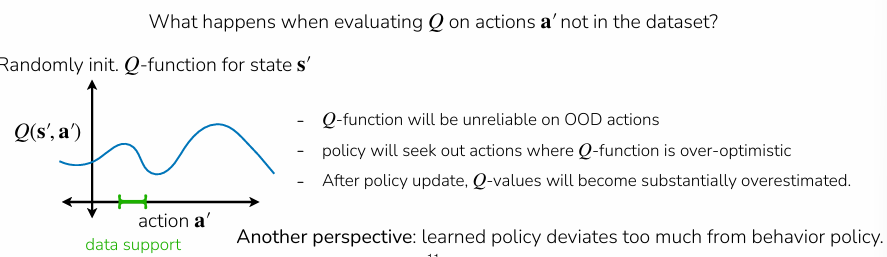

# Offline RL

Online RL: (on-policy or off-policy)

- Collect data → update policy on latest data or data so far → repeat

Offline RL: 

- Given static data, train policy on provided data
- Can be more useful than online RL when
    - Leverage datasets collected by people, existing systems
    - Online policy collection may be risky, unsafe
    - Reuse previously collected data rather than recollecting
        - e.g. previous experiments, projects, robots, institutions

Note: blend of offline then online RL is also possible 

# Why offline RL

Offline dataset $D : {(s,a,s’,r)}$ sampledo from some unkown behaviour policy $\pi_\beta$, which can be a mixture of policies 

$s \sim {\pi_{\beta}}(\cdot)$, $a \sim \pi_\beta(\cdot | s)$, $s’ \sim p(\cdot | s, a)$, $r = r(s,a)$

$\text{Objective: } \max_{\theta} \mathbb{E}_{p_{\theta}(\tau)} \left[ \sum_{t} r(\mathbf{s}_t, \mathbf{a}_t) \right]$

Since offline RL uses a given static data, and policy is trained on this dataset, data comes from:

1. Human collected data
2. Data from a hand-designed system 
3. Data from previous RL runs 
4. Mixture of sources 

# Why offline RL vs imitation learning

Offline data may not be optimal 

- Offline RL can leverage reward information to outperform behaviour policy
- Good offline RL methods can stitch together good behaviours
- Recall that imitation methods can’t outperform the expert

Naive off-policy Q-learning on a static dataset breaks badly due to extrapolation error when actions are out of distribution (OOD):

- Q-function gets queried on $(s,a)$ pairs that are outside the dataset during the $max_a Q(s,a)$ step. Since the function approximator has no training signal there, it can hallucinate arbitrarily high Q-value for OOD actions. Thus, the max operator selects those overestimates which compounds through bootstrapping across timesteps ⇒ Q-Values diverge

e.g. actions $a_4, a_5, a_6$ are OOD, randomly initialised point on max Q value thinks its $a_4$ (see blue dot on the distribution above), but no Q-value for $a_4$ to learn

A simple way to leverage rewards in imitation 

## Filtered behaviour cloning:

Filter to get only sequences of the top K% — “naive”, and thus good benchmark to test against

1. Rank trajectories by return $r(\tau) = \sum_{(s_t,a_t)\in\tau} r(s_t, a_t)$
2. Filter dataset to include top K% of data $D : \{{\tau | r(\tau) > n}\}$
3. Imitate filtered dataset: $max_\theta \sum_{(s,a)\in D} log\pi_\theta(a|s)$

## Advantage-weighted regression

### **Core idea:**

Weight each transition depending on how good the action is, and measure how good an action is using advantage $A^\pi(s_t, a_t) = Q^\pi(s_t, a_t) - V^\pi(s_t)$ ⇒ how much better $a_t$ is 

$\theta \leftarrow \arg\max_\theta , E_{\mathbf{s}, \mathbf{a} \sim \mathcal{D}} \left[ \log \pi_\theta(\mathbf{a} | \mathbf{s}) \exp(A(\mathbf{s}, \mathbf{a})) \right]$

**Estimate** $V^{\pi_\beta}(s)$ **with Monte Carlo:**

$\min_\phi \sum_{\mathbf{s}_t \sim \mathcal{D}} \left| \hat{V}\phi^{\pi_\beta}(\mathbf{s}_t) - \sum_{t'=t}^{T} r(\mathbf{s}_{t'}, \mathbf{a}_{t'}) \right|^2$

**Approximate advantage:**

$\hat{A}^{\pi_\beta}(\mathbf{s}_t, \mathbf{a}_t) = \sum_{t'=t}^{T} r(\mathbf{s}_{t'}, \mathbf{a}_{t'}) - \hat{V}\phi^{\pi_\beta}(\mathbf{s}_t)$

Note: if $\pi_\beta$ is deterministic, every state maps to exactly one action, so the advantage is zero everywhere (no action is better or worse than what you always do). You'd just recover behavior cloning with uniform weights, learning nothing beyond imitating the data policy.

### Full AWR algorithm

1. **Fit value function:**

$\min_\phi \sum_{\mathbf{s}_t \sim \mathcal{D}} \left| \hat{V}\phi^{\pi_\beta}(\mathbf{s}_t) - \sum_{t'=t}^{T} r(\mathbf{s}_{t'}, \mathbf{a}{t'}) \right|^2$

1. Train policy

$\max_\theta  \mathbb{E}{(\mathbf{s}_t, \mathbf{a}_t) \sim \mathcal{D}} \left[ \log \pi\theta(\mathbf{a}_t | \mathbf{s}_t) \cdot \exp\left( \frac{1}{\alpha} \left( \sum_{t'=t}^{T} r(\mathbf{s}_{t'}, \mathbf{a}_{t'}) - \hat{V}\phi^{\pi_\beta}(\mathbf{s}_t) \right) \right) \right]$

### Pros:

- Avoids querying or training on any OOD actions as we do supervised learning on actions already in the dataset ⇒ remove OOD extrapolation problem

### Cons:

- Monte Carlo estimation of  $V^\pi$ is noisy because it uses full trajectory rollouts instead of a learned Q-function for the advantage estimate
- $\hat{A}^{\pi_\beta}$ is weaker than $\hat{A}^{\pi_\theta}$ — means you're estimating advantage under the *behavior* policy, not the policy you're actually learning. So your reweighting signal is slightly misaligned.

## Implicit Q-Learning

### Problem:

Advantage-weighted actor-critic (AWAC) gives $Q^{\pi_\beta}$ — the Q-function of the mediocre behavior policy.  We want $Q$ for a *better* policy, but without querying OOD actions.

### **Insight:**

Refer to histogram in the screenshot below.

For a given state $s$, different actions in the dataset give different $Q(s, a)$ values. The $\ell_2$ loss fits $V(s)$ to the *mean* of $Q(s, a)$ across dataset actions — that's $V^{\pi_\beta}$, the average performance. But what you actually want is $V(s)$ closer to the *upper end* — the best actions in the data support.

**The trick:** Use an asymmetric loss.

- $\ell_2(x) = x^2$ penalizes overestimates and underestimates equally ⇒ you get the mean
- An asymmetric loss (like expectile regression, $\ell_2^\tau$) penalizes underestimates *more* than overestimates ⇒ the fitted $V(s)$ gets pushed toward the higher Q-values

So instead of learning "how good is the average action in the data?", learn "how good are the *best* actions in the data?", without ever querying Q on actions outside the dataset.

This gives advantages for a better-than- $\pi_\beta$ policy implicitly, extracting the best behavior already present in the data without needing to do any OOD maximization.

### Steps

1. **Fit V with expectile loss:**

$\hat{V}(\mathbf{s}) \leftarrow \arg\min_V , E_{(\mathbf{s}, \mathbf{a}) \sim \mathcal{D}} \left[ \ell_2^\lambda \left( V(\mathbf{s}) - \hat{Q}(\mathbf{s}, \mathbf{a}) \right) \right] \quad \text{using small } \lambda < 0.5$

With $\lambda < 0.5$, the loss penalizes underestimates more, so $V(s)$ gets pushed toward the *higher* Q-values in the dataset. This implicitly does policy improvement — you're learning the value of a better-than- $\pi_\beta$ policy without ever explicitly maximizing over actions.

1. **Update Q with standard MSE:**

$\hat{Q}(\mathbf{s}, \mathbf{a}) \leftarrow \arg\min_Q , E_{(\mathbf{s}, \mathbf{a}, \mathbf{s}') \sim \mathcal{D}} \left[ \left( Q(\mathbf{s}, \mathbf{a}) - \left( r + \gamma \hat{V}(\mathbf{s}') \right) \right)^2 \right]$

Notice: the Bellman target uses $\hat{V}(s')$ instead of $\max_{a'} Q(s', a')$. No OOD action query needed — the implicit policy improvement already happened in step 1 via the expectile loss.

1. **Extract policy with AWR:**

$\hat{\pi} \leftarrow \arg\max_\pi , E_{\mathbf{s}, \mathbf{a} \sim \mathcal{D}} \left[ \log \pi(\mathbf{a} | \mathbf{s}) \exp\left( \frac{1}{\alpha} \left( \hat{Q}(\mathbf{s}, \mathbf{a}) - \hat{V}(\mathbf{s}) \right) \right) \right]$

Standard AWR — but now $\hat{Q} - \hat{V}$ is a much better advantage signal because $V$ was fitted to the upper end of the Q distribution, not the mean.

Train step 1 and 2 to convergence → freeze $\hat{Q}$  and  
$\hat{V}$ → step 3 supervised learning i.e. for each $(s,a)$ in dataset, compute the weighted $exp(\frac1\alpha (\hat{Q}(s,a) - \hat{V}(s))$ using frozen network → do weighted behavior cloning.