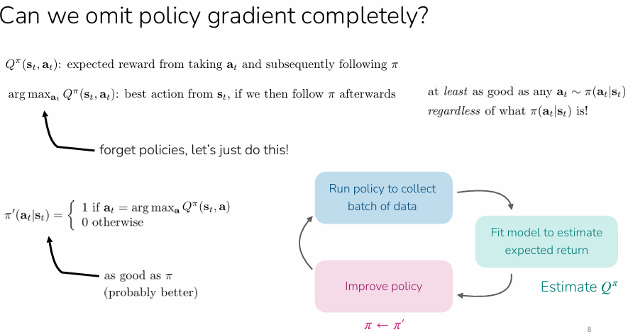

# Q-Learning

# Q-Learning RL Method

## Core Intuition

Q-learning is a **value-based** RL method — instead of learning an explicit policy $\pi_\theta$, we only learn a Q-function and derive the policy from it via $\pi(a_t|s_t) = \arg\max_a \hat{Q}(s_t, a)$. This means we can **skip policy gradients entirely**.

**Recall**: 

- Policy-based methods (REINFORCE, PPO): directly learns a policy $\pi_\theta(a|s)$ — a function that maps states to aciton probabilities. Optimise $\theta$ i.e. the weights to maximise expected return via policy gradient
- Value-based methods (DQN, Q-Learning): learn a value function — either $V(s)$ or $Q(s,a)$ that estimates how much future reward you’ll get. Policy is then derived implicitly, i.,e. pick the action with the highest value. No separate policy network to optimise
- Actor-critic is a hybrid: learn both a value function (critic) and policy (actor). Q-learning’s insight is that if your value function is good enough, the critic alone is sufficient and the actor is redundant.

## Why This Works

If you have an accurate $\hat{Q}^\pi(s,a)$ for some policy $\pi$, then the greedy policy $\pi'(a|s) = \arg\max_a Q^\pi(s,a)$ is **at least as good as** $\pi$ — regardless of what $\pi$ is. So we can iteratively improve by just re-estimating Q and taking the greedy action.

## From Actor-Critic to Q-Learning

In off-policy actor-critic, the target for fitting $\hat{Q}^\pi$ is:

$y_i = r_i + \gamma \hat{Q}^\pi(s'_i, \bar{a}'_i) \quad \text{where } \bar{a}'_i \sim \pi_\theta(\cdot|s'_i)$

The key insight: instead of sampling $\bar{a}'_i$ from the current policy, just **take the max** over actions. This simultaneously does **policy evaluation** and **policy improvement** in one step:

$y_i = r_i + \gamma \max_{a'} \hat{Q}_\phi(s'_i, a')$

This is the **Bellman optimality equation** — it characterizes $Q^{\pi^*}$ for the optimal policy.

### **Recall: Actor-Critic**

In actor-critic, you have two separate things you're learning:

- A **critic** $\hat{Q}^\pi_\phi$ that estimates "how good is taking action $a$ in state $s$, then following policy $\pi$"
- An **actor** $\pi_\theta$ that you improve via policy gradients using the critic's estimates

The critic's training target uses the current policy to sample the next action:

$y_i = r_i + \gamma \hat{Q}^\pi(s'_i, \bar{a}'_i) \quad \text{where } \bar{a}'_i \sim \pi_\theta(\cdot|s'_i)$

This means: "the value of $(s_i, a_i)$ is the immediate reward plus the discounted value of whatever action $\pi$ would take next."

**The greedy improvement insight**

Now suppose your critic is accurate. You know $Q^\pi(s, a)$for every state-action pair. You define a new policy:

$\pi'(a|s) = \arg\max_a Q^\pi(s, a)$

This new policy is guaranteed to be **at least as good as** $\pi$.  Because $Q^\pi(s, a)$ tells you the expected return of taking $a$ then following $\pi$ afterwards. If you pick the $a$ that maximizes this, you're doing at least as well as whatever $\pi$ would have picked — by definition, the max is ≥ any particular sample from $\pi$.

This is the **policy improvement theorem** from the lecture's thought exercise (slide 7–8, the 2D navigation example).

### **The key leap to Q-learning**

So the actor-critic loop is: 

- fit Q → use policy gradient to update $\pi$ → repeat.
    - But if the improved policy is just $\arg\max_a Q(s,a)$, why bother learning $\pi_\theta$ at all? We can just **define** the policy as the argmax of Q. No actor needed.
    - But there's a second, subtler move. In the critic's target:
        
        $y_i = r_i + \gamma \hat{Q}^\pi(s'_i, \bar{a}'_i) \quad \text{where } \bar{a}'i \sim \pi\theta(\cdot|s'_i)$
        
        If our improved policy is $\arg\max$, then sampling $\bar{a}'_i \sim \pi_\theta$ is equivalent to just taking $\max_{a'} Q(s'_i, a')$. So we replace the sample with a max:
        
        $y_i = r_i + \gamma \max_{a'} \hat{Q}_\phi(s'_i, a')$
        

This is doing **two things at once**:

1. **Policy evaluation** — fitting Q to satisfy the Bellman equation
2. **Policy improvement** — the max already encodes "what would the improved policy do"

In actor-critic these were separate steps (fit Q, then gradient step on $\pi$). In Q-learning they're fused into a single update.

### **Bellman Optimality Equation**

The standard Bellman equation for any policy $\pi$ is:

$Q^\pi(s, a) = r(s, a) + \gamma \mathbb{E}_{s'}\left[\mathbb{E}_{a' \sim \pi(\cdot|s')}[Q^\pi(s', a')]\right]$

For the **optimal** policy $\pi$*, since* $\pi^*$ always takes the best action, the inner expectation becomes a max:

$Q^{\pi^*}(s, a) = r(s, a) + \gamma \mathbb{E}_{s'}\left[\max_{a'} Q^{\pi^*}(s', a')\right]$

So when we use $y_i = r_i + \gamma \max_{a'} Q(s'_i, a')$ as our target, we're trying to make our Q-function satisfy this optimality equation — meaning we're directly targeting $Q^{\pi^*}$ rather than $Q^\pi$ for some intermediate policy.

### Full conceptual pipeline:

actor-critic → notice the actor is redundant → fold the policy improvement into the Q target → end up directly optimizing for $Q^*$.

## The Full Algorithm

1. **Collect data**: Take action $a \sim \pi(\cdot|s)$ from some exploration policy, get transition $(s, a, s', r)$, store in replay buffer $\mathcal{R}$
2. **Sample a batch**: Draw ${s_i, a_i, r_i, s'_i}$ from $\mathcal{R}$
3. **Compute targets**: $y_i = r_i + \gamma \max_{a'} \hat{Q}_\phi(s'_i, a')$
4. **Gradient update**: $\phi \leftarrow \phi - \alpha \sum_i \frac{dQ_\phi}{d\phi}(s_i, a_i)\big(Q_\phi(s_i, a_i) - y_i\big)$
5. **Policy is implicit**: $\pi(a_t|s_t) = \arg\max_a \hat{Q}_\phi(s_t, a)$

Repeat steps 2–4 for $K$ gradient steps (inner loop), then collect more data (outer loop).

## Key Property: Off-Policy

Q-learning is **off-policy** — the data in $\mathcal{R}$ can come from any policy, not just the current one. This is because the Bellman optimality equation holds for all $(s,a)$ regardless of how the data was collected. However, you still need **sufficient action coverage** in the data.

## Exploration Strategies

Since Q-learning is off-policy, we need an exploration policy to collect diverse data:

- **Epsilon-greedy**: With probability $\epsilon$ take a random action, otherwise take $\arg\max_a Q(s,a)$. Typically anneal $\epsilon$ from large to small during training.
- **Boltzmann exploration**: Sample actions proportional to $\exp(Q_\phi(s, a))$, giving soft preference to higher-valued actions.

## Convergence

- **Tabular case** (table of Q-values for every $(s,a)$): Guaranteed to converge to $Q^{\pi^*}$
- **Function approximation** (neural nets): No convergence guarantee in general — can diverge even with linear Q. But can be made to work well in practice.

---

## Practical Stabilization Tricks

### 1. Target Networks (DQN)

**Problem**: The target $y_i = r_i + \gamma \max_{a'} Q_\phi(s'_i, a')$ is a **moving target** — as $\phi$ updates, the targets shift, causing instability.

**Solution**: Freeze a copy of the parameters $\phi' \leftarrow \phi$ and use $Q_{\phi'}$ for computing targets. Update $\phi'$ only periodically (every $N$ outer steps). The inner loop then becomes **supervised learning** against fixed labels.

$y_i = r_i + \gamma \max_{a'} Q_{\phi'}(s'_i, a')$

### 2. Double DQN

**Problem**: $\max_{a'} Q_{\phi'}(s', a')$ **overestimates** Q-values because the same noisy network both selects the best action and evaluates its value.

**Key decomposition**: $\max_{a'} Q_{\phi'}(s', a') = Q_{\phi'}(s', \arg\max_{a'} Q_{\phi'}(s', a'))$ — same network does both jobs.

**Solution**: Use the **current network** $Q_\phi$ to select the action, but the **target network** $Q_{\phi'}$ to evaluate:

$y = r + \gamma Q_{\phi'}(s', \arg\max_{a'} Q_\phi(s', a'))$

If the noise in $Q_\phi$ and $Q_{\phi'}$ is decorrelated, the overestimation problem goes away.

### 3. N-Step Returns

**Problem**: 1-step bootstrap ($r + \gamma \max Q$) is low variance but high bias when Q is inaccurate. Full Monte Carlo ($\sum_t r_t$) is unbiased but high variance.

**Solution**: Use N-step targets as a middle ground:

$y_{j,t} = \sum_{t'=t}^{t+N-1} \gamma^{t'-t} r_{j,t'} + \gamma^N \max_{a} Q_{\phi'}(s_{j,t+N}, a)$

**Tradeoffs**:

- ✅ Less biased than 1-step bootstrap (more real rewards, less reliance on Q)
- ✅ Typically faster learning, especially early in training
- ❌ Only fully correct when data is on-policy (the intermediate rewards came from a past policy)
- Common fix:
    - just ignore the off-policy issue and use $N > 1$ anyway
    - Can also dynamically choose N to only use data the follows current policy (if data mostly on-policy and action space is small)
    - Use importance sampling

---

## When to Use Q-Learning vs. Alternatives

| Algorithm | When to use |
| --- | --- |
| **PPO & variants** | Stability, ease-of-use; don't care about data efficiency |
| **DQN & variants** | Discrete actions or low-dim continuous actions |
| **SAC & variants** | Care most about data efficiency; okay with tunin |