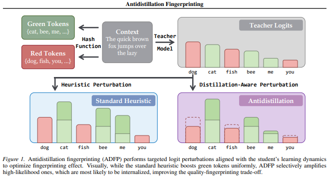

# Antidistillation Fingerprinting

**Builds on:** Antidistillation Sampling 

[Antidistillation Sampling](https://www.notion.so/Antidistillation-Sampling-33b40dfae5f380528f25d48a059a23f3?pvs=21)

# TLDR

**Antidistillation Fingerprinting (ADFP)** is a **distillation detection method** 

- Teacher model optimised to give output tokens that match our fingerprint form (of green tokens).
- Tokens are passed through a hash and secret, whereby at every current token, we apply hash(secret, preceding tokens) to map whether a token is green or red given its preceding tokens.
- When detecting, feed student model prompts and check proportion of green tokens
    - if significantly more than 0.5, then that model is distilled



# Problem

**Problem:**  Distillation attacks to “steal” IP 

**Goal:** Teacher embed fingerprint into its output s.t. if a student trains on them, can detect that the student was distilled frrom the teacher without degrading teacher’s output quality 

**Why not just watermark?** Existing watermarking techniques (e.g., KGW) use heuristic perturbations to bias token selection. These perturbations are not designed to survive the distillation process. To make them stick, you need to crank up the perturbation strength, which tanks output quality. There's a steep quality-vs-detectability tradeoff.

**Solution:** Instead of blindly biasing tokens and hoping the student absorbs the bias, *directly optimize* for which tokens the student will internalize the fingerprint from. Use gradient information from a proxy student model to pick tokens that maximally increase fingerprint detectability after distillation.

# Key Definitions

**Teacher model** $θ_T$**:** The frontier model generating outputs. Its next-token distribution is $p(·|x_{1:t}; θ_T)$.

**Student model** $θ_S$**:** The unknown third-party model being distilled.

**Proxy model** $θ_P$**:** A smaller model we control that *stands in* for the unknown student during the optimization. The key bet is that what's effective against the proxy generalizes to the real student.

**Downstream loss** $ℓ(θ_P)$**:** In antidistillation sampling, this is the NLL (negative log-likelihood $NLL = −Σ log p(x_t | x_{1:t-1}; θ)$) on a holdout reasoning benchmark (the goal is to make the student *worse* at the task). In ADFP, this is replaced with a *fingerprint detectability loss* — a metric that measures how detectable the fingerprint would be in the student after fine-tuning.

**KGW-style watermark (background):** A watermarking scheme where, for each token position, the vocabulary is split into a "green list" and "red list" using a hash of the preceding tokens and a secret key $ξ$. During generation, green-list tokens get a logit boost of $δ$. Detection works by checking whether the proportion of green-list tokens is statistically higher than chance, using a z-score test.

**Fingerprint detectability:** How statistically distinguishable the student's outputs are from an unwatermarked model, typically measured by z-score on green-list token proportion.

# Recap of Antidistillation Sampling

ADFP inherits its core mechanism from antidistillation sampling. Fee;l free to skip this section if you already know about it. 

1. **What does one distillation step look like?**

When the student fine-tunes on a teacher-generated token x_{t+1}, its weights update via gradient descent on the NLL:

$θ_P⁺ = θ_P + η · ∇{θ_P} log p(x_{t+1} | x_{1:t}; θ_P)$

(Note: this is gradient *ascent* on log-likelihood = gradient *descent* on NLL.)

1. **Measure the damage from that token.**

Define $Δ(x_{t+1} | x_{1:t})$ as the change in the downstream loss after the student trains on token $x_{t+1}$:

$Δ(x_{t+1} | x_{1:t}) = ℓ(θ_P⁺) − ℓ(θ_P)$

- If $Δ > 0$: training on this token *hurts* the student on the downstream objective ⇒ good for the poisoner/fingerprinter
- If $Δ < 0$: training on this token *helps* the student ⇒ bad for the poisoner

Note: 

In antidistillation sampling, $ℓ$ = task loss, so $Δ > 0$ means the student gets worse at the task.
In ADFP, ℓ = negative fingerprint detectability, so $Δ > 0$ means the student becomes *more detectable*.

1. **Problem: computing Δ for every token in the vocabulary is absurdly expensive.**

Each token requires: 

- gradient computation
- weight update
- a full evaluation of ℓ on a large dataset.

That's $|V|$ times, where $|V|$ ~ 32k–128k.

1. **The trick: take the limit** $η → 0$ **and swap the finite difference direction.**

Dividing by $η$ and taking the limit:

$lim_{η→0} (1/η) · Δ(x_{t+1} | x_{1:t}) = ⟨∇ℓ(θ_P), ∇{θ_P} log p(x_{t+1} | x_{1:t}; θ_P)⟩$

This is now an inner product of two gradients. But computing $∇{θ_P} log p(x{t+1} | ...)$ for every token $x_{t+1}$ is still expensive.

1. **The key insight: swap which term the finite difference operates on.**

The inner product is symmetric. We can equivalently write it as a finite difference in the *other direction*:

$Δ̂(x_{t+1} | x_{1:t}) = [ log p(x_{t+1} | x_{1:t}; θ_P + ε·g) − log p(x_{t+1} | x_{1:t}; θ_P − ε·g) ] / (2ε)$

where $g = ∇ℓ(θ_P)$.

**Why is this brilliant?** Now we only need:

1. Compute $g = ∇ℓ(θ_P)$ **once** (one backward pass over the holdout set)
2. Create two weight-perturbed copies: $θ_P + εg$ and $θ_P − εg$
3. For each generated token: run two forward passes (one per copy) to get log-probs for **all** tokens simultaneously

Cost per token: 2 forward passes through the proxy. No more per-token gradient computations.

**Step 6 — Sample from the adjusted distribution.**

$x_{t+1} \sim \frac1Z · exp( \frac1τ · log[p(·|x_{1:t}; θ_T) + λ · Δ̂(·|x_{1:t})] )$

- First term: stay close to the teacher's natural distribution (quality)
- Second term: prefer tokens where Δ̂ is large (fingerprinting/poisoning strength)
- $λ$: controls the tradeoff between quality and fingerprint strength
- $τ$: temperature (typically 0.6)

# ADFP: The Fingerprinting Twist

**Antidistillation sampling:** $ℓ =$  NLL on a reasoning benchmark holdout set. Goal: make student *bad at the task*.

**ADFP:** $ℓ$ = a loss that measures fingerprint detectability. Goal: make the student *detectable* as having been distilled.

hash + secret key together are like a **combination lock on a codebook**. The hash function takes (key $ξ$, preceding tokens) and outputs a deterministic but pseudorandom assignment of every vocabulary token to green or red.

The entire machinery (proxy model, finite difference, adjusted sampling distribution) stays the same. The only change is **what you're optimizing for** in the downstream loss ℓ.

## **Difference vs antidistillation sampling:**

- Instead of computing $g = ∇ℓ(θ_P)$ where $ℓ$ = task NLL on holdout set, ADFP computes $g = ∇ℓ_{fp}(θ_P)$ where $ℓ_{fp}$ measures how much the proxy model's outputs would exhibit the fingerprint pattern (e.g., green-list token preference) after training on the teacher's outputs.
- The gradient $g$ now points in the direction of weight space that *maximizes* fingerprint absorption by the student.
- The finite difference Δ̂  then identifies which tokens, when learned by the student, will cause the student to produce more green-list tokens (or whatever the fingerprint signal is).

## **Why this is better than naive watermarking for distillation detection:**

- Naive watermark: biases teacher's outputs toward green tokens. Student may or may not internalize this bias — it's incidental.
- ADFP: directly selects tokens that the student's learning dynamics will amplify into a detectable pattern. The fingerprint is *targeted* at how SGD updates propagate.

---

# Detection Pipeline

1. **Embedding phase (at generation time):** Teacher generates outputs using ADFP-adjusted sampling with secret key $ξ$.
2. **Suspicion phase:** You encounter a suspicious model that may have been distilled.
3. **Detection phase:** Prompt the suspect model to generate text. For each token, compute the green/red list partition using the secret key ξ and preceding context. Count the proportion of green-list tokens.
4. **Hypothesis test:** Under $H₀$ (no distillation), green token proportion $≈ γ$ (the green list ratio, typically 0.5). Under $H₁$ (distilled from fingerprinted teacher), green token proportion $> γ$. Compute z-score. If z > threshold ⇒ detection.
    1. $\gamma$ is set to 0.5 because under null $H_0$ of no distillation, we expected proportion of green and red tokens to be 50% at random. If diverges a lot from 0.5, we know its distilled. 

Z-score is the core detection metric: higher z ⇒ more confident detection of distillation.

---

# Intuition

The vocabulary at each step has thousands of valid next tokens. Many of them produce roughly equivalent output quality. Among those near-equivalent tokens, ADFP picks the one that:

1. a student model would *learn from most strongly* (high gradient signal), AND
2. would push the student toward generating more green-list tokens in the future.

It's exploiting the fact that not all synonyms/paraphrases are equal from the student's gradient perspective. Some tokens are "stickier" — they create stronger learning signals that the student internalizes more deeply. ADFP finds and preferentially samples those sticky tokens, specifically the ones that reinforce the fingerprint pattern.

---

# Algorithm

## High Level

**During generation (embedding):**

- Teacher generates token at position $t$
- $hash(ξ, x_{t-1})$ → partition vocabulary into green/red
- ADFP biases sampling toward green tokens (among those that also score high on $Δ̂$)
- Token $x_t$ gets generated and served to the user
- Move to position $t+1$, now $hash(ξ, x_t)$ gives a *new* partition
- Repeat

**During detection:**

- Have a suspect student model
- Prompt it with some test prompts and collect its generated text: $x_1, x_2, ..., x_N$
- For each position t, recompute $hash(ξ, x_{t-1}$) → reconstruct the green/red partition that *would have applied* at that position
- Check: was $x_t$ green or red?
- Count the proportion of green tokens across all partitions
- Run z-test

Note: At every new token $x_t$, there will be a new partition of green and red tokens. 

## Step by Step

```latex
INPUT: Prompt x_{1:n}, max tokens N, λ, ε, τ, secret key ξ

PRECOMPUTE (once):
  1. g ← ∇ℓ_{fp}(θ_P)           # gradient of fingerprint detectability loss
  2. θ⁺ ← θ_P + ε·g             # perturbed proxy (positive direction)
  3. θ⁻ ← θ_P − ε·g             # perturbed proxy (negative direction)

FOR EACH token t = n, n+1, ..., N-1:
  4. Compute green/red list for position t using hash(ξ, preceding tokens)
  5. Forward pass through θ⁺ → get log p(·|x_{1:t}; θ⁺)
  6. Forward pass through θ⁻ → get log p(·|x_{1:t}; θ⁻)
  7. Δ̂(·|x_{1:t}) = [log p(·|θ⁺) − log p(·|θ⁻)] / (2ε)
  8. Sample x_{t+1} ~ (1/Z) exp( (1/τ)·log p(·|x_{1:t}; θ_T) + λ·Δ̂(·|x_{1:t}) )

OUTPUT: Fingerprinted sequence x_{1:N}
```

## Example Sequence

```latex
Position 1: hash(ξ, x_0) → partition_1 → is x_1 green or red? ✓
Position 2: hash(ξ, x_1) → partition_2 → is x_2 green or red? ✓
Position 3: hash(ξ, x_2) → partition_3 → is x_3 green or red? ✓
Position 4: hash(ξ, x_3) → partition_4 → is x_4 green or red? ✓
Position 5: hash(ξ, x_4) → partition_5 → is x_5 green or red? ✓
```

# Key Hyperparameters

| Param | Role | Typical Value |
| --- | --- | --- |
| λ | Fingerprint strength vs. quality tradeoff | Swept; higher = stronger fingerprint, lower quality |
| ε | Finite difference step size for approximating Δ | 10⁻² (for BFloat16 models) |
| τ | Sampling temperature | 0.6 |
| ξ | Secret key for green/red list partition | Random; kept secret by model owner |
| γ | Green list ratio | ~0.5 |

---

# Key Results

**Benchmarks:** GSM8K, OASST1

**Main claim:** ADFP achieves a *Pareto improvement* over baselines — for any given level of output quality degradation, ADFP achieves stronger fingerprint detection (higher z-scores) than KGW-style watermarking or other heuristic perturbation methods.

**Robustness to unknown architectures:** Because ADFP uses a proxy model (not the real student), and antidistillation-style perturbations generalize across model families (shown in the predecessor paper with Qwen proxy → Llama student), ADFP works even when the student architecture is unknown.

## Figures

Notes regarding the figures: 

- **Blue (Red-and-Green-List):** Naive KGW watermarking baseline. Each blue dot is a different δ (perturbation strength).
- **Red (Antidistillation):** ADFP. Each red dot is a different λ.
- **Green (Unfingerprinted):** No fingerprint at all. This is the control — should sit above p = 0.05.
- Lower NLL = generated more probable under the model ⇒ higher quality
- Lower p-value ⇒ stronger detection (more confident the student was distilled)

### Figure 3


Figure 3: Red dots (ADFP) consistently sit lower and more to the left than the blue dots. That's the Pareto improvement claim: for the same quality level, ADFP gives you better detection, or equivalently, for the same detection strength, ADFP preserves more quality.

### Figure 4


Figure 4: Red dots still dominate the blue ⇒ even when student achieves decent accuracy, ADFP can still detect distillation 

### Figure 5


Figure 5: As you move right (more fingerprinted data in the training mix), p-value drops (detection gets stronger)

# Comparison Table

| Method | How it works | Quality hit | Survives distillation? |
| --- | --- | --- | --- |
| KGW watermark | Boost green-list logits by fixed δ | Moderate at high δ | Weak — student doesn't reliably internalize the bias |
| Temperature sampling | Increase τ to add noise | High at high τ | No — random noise doesn't create learnable patterns |
| Antidistillation sampling | Gradient-informed token selection to maximize task loss | Tunable via λ | N/A (goal is poisoning, not detection) |
| **ADFP** | Gradient-informed token selection to maximize fingerprint detectability | Tunable via λ | **Yes — directly optimized for post-distillation detection** |

# References

- [https://arxiv.org/abs/2602.03812](https://arxiv.org/abs/2602.03812)