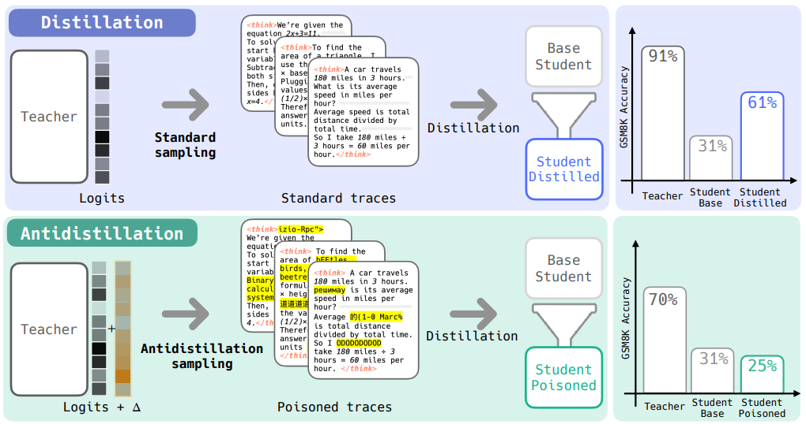

# Antidistillation Sampling

# TLDR

Modify the teacher's sampling distribution at inference time so generated reasoning traces are still useful to end users but **toxic as training data** for anyone trying to distill the model.



# Problem

Frontier reasoning models (o1, R1) always produce chain-of-thought traces as part of how they work. These traces are gold for distillation — a competitor collects thousands of (prompt, trace) pairs via API, fine-tunes a smaller student model on them via supervised learning (minimizing NLL on teacher tokens), and cheaply replicates frontier capabilities. This is allegedly how DeepSeek distilled from o1. Model owners want to protect their IP without degrading user experience.

# Key Definitions

**Logits:** The raw unnormalized scores a language model outputs for every token in its vocabulary *before* converting to probabilities via softmax. 

**Gradient step:** One iteration of updating model weights to reduce a loss.  `θ_new = θ − η·∇L(θ)`

**Downstream loss (ℓ):** The loss on the task you actually care about — e.g., cross-entropy loss of the proxy model on a holdout set of GSM8K reasoning traces. This measures "how good is this model at math reasoning." Distinct from the distillation training loss (which just measures how well the student mimics the teacher's tokens). The whole trick is finding tokens where the student can learn to mimic the teacher (training loss goes down) but gets *worse* at actually solving problems (downstream/holdout loss goes up).

**Proxy student (θ_P):** A small model the teacher owner controls, standing in for the unknown attacker model. You design the poison against this proxy and hope it generalizes to whatever model the attacker actually uses.

# Three Models in Play

| Model | Role |
| --- | --- |
| **Teacher** ($θ_T$) | Frontier model being queried. You own this. |
| **Proxy student** ($θ_P$) | Small model you control, stand-in for unknown attacker |
| **Actual student** ($θ_S$) | Attacker's model (unknown to you) |

# Two Desiderata

1. **Non-distillability** — Students trained on poisoned traces perform *worse* on downstream tasks vs. students trained on normal traces
2. **Nominal utility** — Poisoned traces remain high-probability under the teacher's original distribution (still look good to end users)

---

# Intuition (Analogy)

You're a math tutor, and you suspect someone is recording your lessons to train a competing tutor. You could still solve every problem correctly (so real students aren't affected), but deliberately explain using slightly misleading intermediate reasoning — shortcuts that happen to work for *this* problem but teach terrible habits if someone tries to generalize from them. The final answers are mostly right, but the reasoning traces encode subtle patterns that, when learned across thousands of examples, actively degrade the student's generalization.

---

# Algorithm


### Phase 1: Offline Setup (done once)

1. Generate reasoning traces from the teacher on a holdout dataset
2. Compute the gradient of the proxy student's downstream loss on this holdout set: $g = ∇ℓ(θ_P)$This vector $g$ points in the direction in weight space that makes the proxy *worse* at the task.
3. Create two frozen perturbed copies of the proxy:
    - $θ_P⁺ = θ_P + ε·g$ (proxy nudged toward worse performance)
    - $θ_P⁻ = θ_P − ε·g$ (proxy nudged toward better performance) i.e. the proper way
    
    We need both because for each token, we want to compare would it get better or worse at the downstream task if the proxy student were to train on that token. 
    

### Phase 2: Per-Token Sampling (every decoding step)

**Step 1 — Teacher produces normal logits.** 

Teacher sees prompt + tokens so far, outputs its standard logit vector over the full vocabulary. This is the "what would I normally say" signal.

**Step 2 — Both proxy copies score every token.** 

Run the same input through $θ_P⁺$ and $θ_P⁻$. Each gives log-probabilities over the full vocabulary. Take the difference:

$Δ̂(token) = [log p(token | θ_P⁺) − log p(token | θ_P⁻)] / 2ε$

which is basically 

$\hat{\Delta}(\cdot \mid x_{1:t}) = \frac{\log p(\cdot \mid x_{1:t}; \theta_P + \epsilon \nabla \ell(\theta_P)) - \log p(\cdot \mid x_{1:t}; \theta_P - \epsilon \nabla \ell(\theta_P))}{2\epsilon}$

This is computed for ALL tokens at once — just two forward passes, then element-wise subtraction.

FYI: 

$⟨∇ℓ(θ_P), ∇_{θ_P} log p(token | θ_P)⟩$ inner product is the exact way to compute this directional derivative. However, since this requires computing per-token gradients for all N tokens, we approximate it with $f'(x) ≈ [f(x + ε) − f(x − ε)] / 2ε$, thus needing 2 proxy copies 

**Step 3 — Interpret Δ̂ (the "poison score").**

- $Δ̂$ positive ⇒  the *worse* proxy likes this token more than the *better* proxy → this token teaches bad habits → good for poisoning
- $Δ̂$ negative ⇒  the *better* proxy likes this token → this token genuinely helps the student learn → avoid sampling this
- $Δ̂$ near zero ⇒  neutral, doesn't matter for distillation

**Step 4 — Combine and sample.**

 Add poison scores to teacher logits before softmax:

```
adjusted_logits = (1/τ) · teacher_logits + λ · Δ̂
```

Softmax → sample. Teacher logits keep output coherent. Δ̂   tilts distribution toward poison tokens. λ controls how much tilting.

**Step 5 — Repeat.** 

Append sampled token to context, go back to Step 1.

# Why the Distribution Changes

The **original distribution** is the teacher's normal next-token probabilities: $p(x | θ_T)$.

The **new distribution** adds the Δ̂  penalty to logits before softmax: 

$x_{t+1} \sim \frac{1}{Z} \exp\left[\frac{1}{\tau} \log p(\cdot \mid \theta_T) + \lambda \hat{\Delta}(\cdot)\right]$

Note: normal sampling is 

$x_{t+1} \sim \frac{1}{Z} \exp\left[\frac{1}{\tau} \log p(\cdot \mid \theta_T)\right]$

and $1/Z$ is the normalization constant. $Z$ is the sum of `exp[...]` over all tokens, 

The distribution changes because Δ̂ reshapes the probability mass — boosting tokens that are poisonous for distillation and suppressing tokens that would help a student learn. At small λ this is a gentle nudge among already-plausible tokens. At large λ the distribution warps heavily and traces become incoherent.

# Why It's Efficient (the Clever Math)

**Naive approach (infeasible):** For each of 50k possible next tokens, simulate a distillation step on the proxy, evaluate the proxy on the entire holdout set, check if it got worse. That's 50k × (forward + backward + full eval) per decoding step.

**Key insight:** Take the limit as learning rate η → 0. The "how much does this token hurt the student" quantity becomes a directional derivative:

```
lim (1/η)·Δ(x_{t+1}) = ⟨∇ℓ(θ_P), ∇_{θ_P} log p(x_{t+1} | θ_P)⟩
```

**Second insight:** Exploit inner product symmetry. Instead of differentiating log p w.r.t. θ_P for each token (expensive), flip the finite difference to the *other* argument — perturb θ_P itself:

```
Δ̂(·) = [log p(· | θ_P + ε·g) − log p(· | θ_P − ε·g)] / 2ε
```

One forward pass gives log-probs for ALL tokens simultaneously. So two forward passes through a small proxy → Δ̂ for the entire vocabulary. Total overhead: ~2× proxy forward passes per teacher decoding step. Since proxy is ~half the teacher's size, this roughly doubles inference cost.

# Why It Generalizes Across Model Families

Poisoned traces cause the student's *training* loss to go down but *holdout* loss to go up The traces are learnable — the student can fit them — but they encode spurious patterns that don't generalize. This overfitting dynamic is a property of the traces themselves, not architecture-specific. Empirically confirmed: poison designed against Qwen-3B proxy degrades Llama-3.2-3B student.


# Why End Users Aren't Badly Affected

**No formal proof — this is empirical.** They measure teacher accuracy (does the final boxed answer stay correct?) and show it drops only 1-2% at low λ.

Intuitions for why it degrades gracefully:

- **Teacher logits dominate at low λ.** The Δ̂ perturbation is small relative to the teacher's logit magnitudes, so you're picking among tokens that were all plausible anyway — just nudging *which* top candidate gets selected.
- **Poison compounds over thousands of examples, not one.** A single trace with slightly suboptimal token choices is indistinguishable from a normal trace. The damage happens when a student trains on thousands and absorbs systematic bad patterns. A human reads one trace — they don't aggregate statistics.
- **At high λ it absolutely does hurt users.** Traces devolve into gibberish (random Chinese characters, "XML-Rpc fiber fiber"). The paper doesn't claim otherwise — the contribution is that the trade-off curve is *favorable*.

**What's NOT measured:** human evaluation of trace quality, whether reasoning is actually sound vs. arriving at correct answers via wrong paths, subtle coherence degradation. "Teacher accuracy" is a narrow proxy for "end user experience."

# Key Hyperparameters

| Param | What it does | Practical choice |
| --- | --- | --- |
| **λ** | Trade-off between utility and poisoning. Higher = more poison, worse teacher quality. | Sweep to find sweet spot per deployment |
| **ε** | Controls finite-difference approximation quality. Too small → floating point errors. Too large → bad Taylor approximation. | 10⁻² for BFloat16 models |
| **τ** | Temperature for teacher sampling | 0.6 (paper finds τ ∈ [0,1] doesn't significantly impact results) |

# Key Results

- **GSM8K:** 1% teacher accuracy drop (90%→89%) causes distilled student to drop from 65%→56%. Temperature sampling at the same teacher accuracy barely moves the student.
- To get the student below its undistilled baseline via temperature alone, you'd need to tank the teacher to ~20%. Antidistillation achieves this with teacher still at ~70%.
- Works across all three benchmarks (GSM8K, MATH, MMLU) and across model families (Qwen↔Llama).
- Proxy model size is flexible — works with 1.5B, 3B, and 7B proxies against a 3B student.

# Comparison to Alternatives

| Method | Limitation |
| --- | --- |
| **Temperature sampling** | Degrades teacher and student roughly equally — no targeted poisoning |
| **Watermarking** | Static/deterministic — attacker can learn inverse transform from input-output pairs |
| **Top-k logit truncation** | Harms distillation somewhat but not designed to maximize damage |
| **Session-dynamic defense (Chen et al.)** | Monitors query sensitivity, perturbs after threshold — not per-token |
| **Antidistillation sampling** | Fully dynamic, per-token, uses hidden proxy gradient — a moving target like a stream cipher |

# Connections / Related Ideas

- **Controlled decoding:** Antidistillation is a form of reward-guided decoding where the "reward" is "how much does this token hurt the student." Related to RLHF decoding, contrastive decoding, energy-based decoding.
- **Data poisoning:** Bridge between data poisoning literature and model security — crafting training data that induces bad downstream behavior.
- **Zeroth-order optimization:** The finite-difference trick for approximating directional derivatives through weight space is the same technique used in evolutionary strategies / zeroth-order gradient estimation.

# References
- https://arxiv.org/pdf/2504.13146