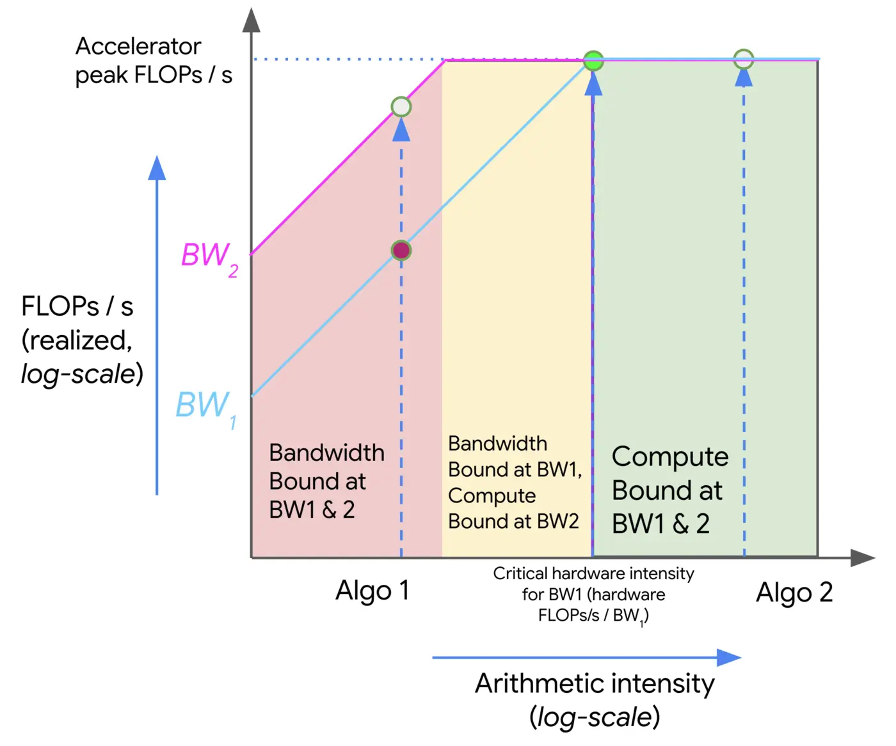

# Roofline

# Breakdown of Time

[https://jax-ml.github.io/scaling-book/roofline/](https://jax-ml.github.io/scaling-book/roofline/)

1. Computation
    
    $T_{math} = \frac{Computation FLOPs}{Accelerator FLOPs / s}$
    
2. Communication within a chip (HBM Bandwidth)
    
    HBM: Accelerator memory
    
    Within an accelerator, tensors need to be transferred between HBM and compute cores 
    
3. Communication between chips 
    
    When ditsributing a model across multiple accelerators, tensors frequently need to be transferred between them. 
    

Whether the communication is within a chip or between chips, we measure in bytes/s and estimate the total communication time with

$T_{comms} = \frac {Communication Bytes} {Network/Memory Bandiwdth Bytes/s}$

Typically, (1) can be overlapped with (2) and (3) — i.e. computation and communication can occur at the same time 

This means we can lower-bound training and inference time by using the `max(computation time, communication time)` . We can also upper-bound with their sum.

$T_{lower} = max(T_{math}, T_{comms})$

$T_{upper} = T_{math} + T_{comms}$

Assuming we can perfectly overlap communication and computation

- $T_{math} > T_{comms}$ ⇒ compute-bound
- $T_{comms} > T_{math}$ ⇒ communication-bound

Arithmetic Intensity: ratio of total FLOPs it performs to the number of bytes it needs to communicate (either within a chip or between chips)  

Intuitively, it is the “computation per trip to memory”.

$Arithmetic Intesnity = \frac {Computation FLOPs} {Communication Bytes}$

Measures FLOPs per communication bytes

$Intensity(Accelerator)$ is the arithmetic intensity at which accelerator achieve its peak FLOPs/s.

For Accelerator (ie hardware), the lower the intensity the better.

- hardware needs fewer FLOPs per byte to hit peak utilisation ⇒ easier for algorithms to be compute bound

For Computation, the higher the intensity the better 

- Higher algorithm intensity ⇒ more compute per byte loaded ⇒ better data reuse ⇒ less likely to be memory bottlenecked

Example: Dot Product

compute the dot product of two vectors in bfloat16 precision, `x • y: bf16[N], bf16[N] → bf16[1]` ,

load $x$ and $y$ from memory, each of size $2N$ bytes, perform $N$ multiplications and $N -1$ additions, and write 2 bytes back into HBM.

$Intensity(dot product) = \frac {Total FLOPs} {Total Bytes} = \frac {N + N -1} {2N + 2N+ 2} = \frac {2N -1} {4N + 2} → \frac 12$

 as $N → \infty$

Example: Matrix Multiplication with Network Communication 

Memory Loaded: 2DF + 2BD bytes

Performance: 2BDF bytes (if single matrix, 2 because each operation will be multiplied then added)

Memory Written: 2BF bytes

Question: Why high precision for activations but lower precision for weights

Weights are used many times during inference and huge, while activations are produced dynamically from the input layer by layer and the range is more dynamic ⇒ require higher precision 

