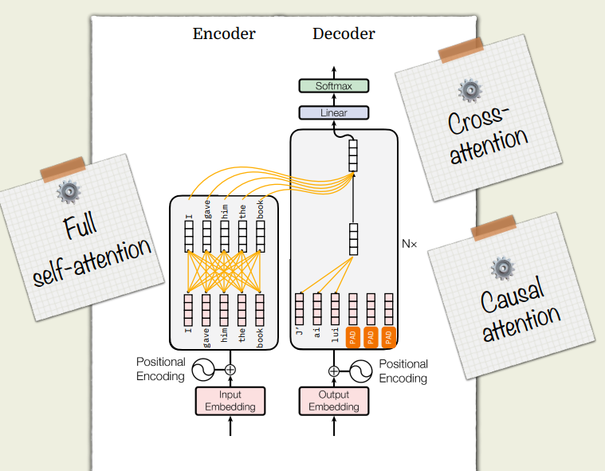

# Encoder, Decoder, Encoder-Decoder

# TLDR:

1. Encoder: Self-attention — bidirectional, no masking 
2. Decoder: next token prediction, given past words
3. Encoder-Decoder: seq2seq — originally for language translation
    1. idea is that you need self-attention to give original embeddings more context 
        1. thus values in embeddings will change
    2. then you will need to generate sentence in the targeted language, which thus needs the element of decoder only of predicting the next word
    3. however, when generating, you will need to know which ones 
    4. We dont use encoder-decoder for next token prediction because thats cheating (i.e. it already saw the whole sequence of future tokens, and will likely predict what it already saw) 

# 1. Encoder-only models

**Examples:** BERT, RoBERTa, DeBERTa

## Architecture

- Stack of **encoder blocks only**
- Self-attention is **bidirectional**:
    - Mask `M` is usually zero everywhere (except padding)
    - Each token can attend to *all* tokens in the sequence

Formally, for token `i`, attention can use all tokens `j ∈ \{1…T\}`.

## Training objective

Typically **Masked Language Modeling (MLM)**:

- Corrupt the input by masking some positions, e.g.
    
    `"The cat sat on the \[MASK\]."`
    
- Predict the original token at masked positions using **full context**
- Loss: cross-entropy **only on masked positions**

This encourages deep **contextual representations** of the whole sequence.

## Typical use

Encoder-only models output contextual embeddings `H ∈ R\^\{T × d\}` and are used for:

- Sentence / document classification (pool over tokens)
- Token classification (NER, POS tagging, etc.)
- Embeddings for retrieval / semantic similarity
- Re-ranking and other understanding-heavy tasks

They are **not naturally generative** (no causal constraint, no decoding loop), though people sometimes adapt them for limited generation.

# 2. Decoder-only models (most modern LLMs)

**Examples:** GPT-2/3/4, LLaMA, Mistral, etc.

## Architecture

- Stack of **decoder blocks only**
- Self-attention is **causal**:
    - Mask `M` is **upper-triangular**
    - Token at position `i` can only see tokens `1…i` (no future tokens)

At training time you still process full sequences, but future tokens are hidden by the mask.

## Training objective

Standard **autoregressive language modeling**:

Given a sequence of tokens `(x₁, …, x_T)`, maximize:

$$
\sum_{t=1}^{T} \log p(x_t | x_1, \ldots, x_{t-1})
$$

Implemented as **next-token prediction** with cross-entropy over all positions (except possibly the first).

## Why this fits LLMs

At **inference**, you apply the model in a loop:

1. Condition on a **prompt** (input text)
2. Sample / argmax the next token
3. Append it to the sequence
4. Feed the extended sequence back into the model
5. Repeat

There is **no architectural distinction** between “input” and “output”:

- Everything is a single token stream: `prompt → continuation`

This makes decoder-only models very flexible:

- Translation:
    
    `"Translate to French: \<English sentence\>" → model completes with French`
    
- Q&A:
    
    `"Question: ... Answer:" → model completes the answer`
    
- Code generation, reasoning, chat, etc.

**Key idea:** Treat *all* tasks as **conditional text generation**.

# 3. Encoder–Decoder (seq2seq) models

**Examples:** Original Transformer (Vaswani et al.), T5, BART, mT5

Here we explicitly separate **source** and **target** sequences.

### Architecture

Two stacks:

### 1. Encoder

- Input: source tokens `X(src)`
- Self-attention is **bidirectional**
- Output: hidden states `H(enc) ∈ R\^\{T_src × d\}`

### 2. Decoder

- Input: target prefix tokens `Y₁…Y_\{t−1\}`
- Uses two attention mechanisms:
    1. **Masked self-attention** (causal) over target tokens
    2. **Cross-attention** over encoder outputs `H(enc)`

Cross-attention (conceptually):

$$
Q = H_{\text{dec}} W_Q
$$

$$
K = H_{\text{enc}} W_K
$$

$$
V = H_{\text{enc}} W_V
$$

$$
\text{CrossAttn} = \text{softmax}\left(\frac{Q K^T}{\sqrt{d_k}}\right) V
$$

Each decoder token can attend to **all encoder tokens** (no causal mask on the encoder side).

### Training objective

Still **autoregressive** on the target sequence:

$$
\sum_{t=1}^{T_{\text{tgt}}} \log p(y_t | y_{<t}, X^{(\text{src})})
$$

- The source sequence is fully consumed by the encoder
- The decoder conditions on encoder outputs via cross-attention

### Typical use

Best when you have a clear **input → output** mapping:

- Machine translation
- Summarization (long article → short summary)
- Text rewriting / paraphrasing
- General “text-to-text” tasks (T5’s philosophy: everything is text → text)

The **inductive bias** here:

> First fully understand the input (encoder), then generate the output while looking back at that understanding (decoder).
> 

# 4. Side-by-side comparison

## Attention patterns

### **Encoder-only**

- Self-attention: **bidirectional**
- No cross-attention
- Mask: mainly for padding

### **Decoder-only**

- Self-attention: **causal (uni-directional)**
- No cross-attention
- Mask: upper-triangular (no future tokens)

### **Encoder–Decoder**

- Encoder:
    - Self-attention: **bidirectional**
- Decoder:
    - Self-attention: **causal**
    - **Cross-attention** to encoder outputs
- Works on **two sequences** (source vs target)

## Functional roles

**Encoder-only → “Representation learner”**

- Input text → contextual embeddings
- Use for classification, ranking, retrieval, etc.

**Decoder-only → “Universal generator”**

- Prompt in → model continues the sequence
- Use for general LLM behavior (chat, code, reasoning, etc.)

**Encoder–Decoder → “Sequence transducer”**

- Source sequence in → different target sequence out
- Use for translation, summarization, and structured text-to-text tasks

# 5. Why LLMs mostly use decoder-only

Some practical reasons:

1. **Unified interface**
    - Any task becomes: “prompt → completion”
    - No need to wire up separate input/output stacks
2. **Scaling simplicity**
    - One big stack of identical blocks is easier to:
        - Scale to billions of parameters
        - Optimize and deploy efficiently
3. **Generalization via prompting**
    - With scale + instruction tuning, the *same* model can:
        - Answer questions
        - Write code
        - Translate
        - Summarize
        - Do reasoning
    - …without changing the architecture

Encoder-only and encoder–decoder models are still very useful for specialized tasks (retrieval, ranking, classic MT, etc.). But when people say **“LLM”** today, they almost always mean a **large decoder-only Transformer trained autoregressively**.

# References:

1. [https://www.patreon.com/posts/142929108?collection=1458986](https://www.patreon.com/posts/142929108?collection=1458986)